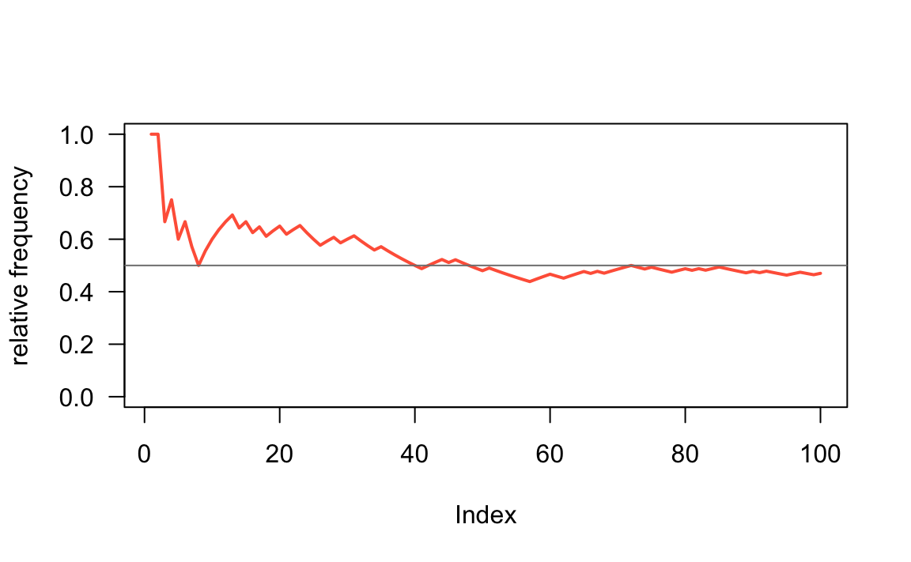

--- 
title: "Pack Your Code"
author: "Gaston Sanchez"
date: ""
site: bookdown::bookdown_site
documentclass: book
bibliography: [book.bib, packages.bib]
biblio-style: apalike
link-citations: yes
description: "Basic example of how to create an R package based on S3 classes."
---


# Preface {-}


This book aims to teach you how to create a relatively simple R package based on the so-called S3 classes.

I assume that you are already familiar with R, RStudio. You don't need to be an expert useR but you do need to feel comfortable working with various data structures: vectors, factors, arrays, matrices, lists, data frames, etc.

You also need to be familiar with programming structures: how to create simple functions, conditional `if-then-else()`, `for()` loops, `while()` loops, `repeat` loops.


You will create various functions:

- define a function to create a `"coin"` object.

- write a function to `toss()` the coin and produce an object of class `"toss"`.

- write common methods such as `print()`, `summary()`, and `plot()`.

- write companion functions `is.toss()`, `as.toss()`

- implement S3 methods for extraction `[.toss`, replacement `[<-.toss`, addition `+.toss`


You will write unit tests for your functions


You will package your code, and learn an opinionated workflow to build packages:

- generate documentation
- check manual documentation
- run tests
- build vignettes
- build tarball
- install your package
- share it via github

-----


<a rel="license" href="http://creativecommons.org/licenses/by-nc-sa/4.0/"></a><br />This work, by [Gaston Sanchez](http://gastonsanchez.com), is licensed under a <a rel="license" href="http://creativecommons.org/licenses/by-nc-sa/4.0/">Creative Commons Attribution-NonCommercial-ShareAlike 4.0 International License</a>.

<!--chapter:end:index.Rmd-->


# (PART) Motivation {-}

# Let's toss a coin {#intro}

To illustrate the concepts behind object-oriented programming in R, we are going to consider a classic chance process (or chance experiment) of flipping a coin.


In this chapter you will learn how to implement code in R that simulates tossing a coin one or more times.


## Coin object

Think about a standard coin with two sides: _heads_ and _tails_.

<div class="figure" style="text-align: center">

<p class="caption">(\#fig:unnamed-chunk-5)two sides of a coin</p>
</div>

To toss a coin using R, we first need an object that plays the role of a coin. How do you create such a coin? Perhaps the simplest way to create a coin with two sides, `"heads"` and `"tails"`, is with a character vector via the _combine_ function `c()`:


```r
# a (virtual) coin object
coin <- c("heads", "tails")
coin
#> [1] "heads" "tails"
```

You can also create a _numeric_ coin that shows `1` and `0` instead of
`"heads"` and `"tails"`:


```r
num_coin <- c(0, 1)
num_coin
#> [1] 0 1
```

Likewise, you can also create a _logical_ coin that shows `TRUE` and `FALSE` 
instead of `"heads"` and `"tails"`:


```r
log_coin <- c(TRUE, FALSE)
log_coin
#> [1]  TRUE FALSE
```


## Tossing a coin

Once you have an object that represents the _coin_, the next step involves learning how to simulate tossing the coin.

Tossing a coin is a random experiment: you either get heads or tails. One way to simulate the action of tossing a coin in R is with the function `sample()` which lets you draw random samples, with or without replacement, of the elements of an input vector. 

Here's how to simulate a coin toss using `sample()` to take a random sample of size 1 of the elements in `coin`:


```r
# toss a coin
coin <- c('heads', 'tails')

sample(coin, size = 1)
#> [1] "tails"
```

You use the argument `size = 1` to specify that you want to take a sample of size 1 from the input vector `coin`.


### Random Samples

By default, `sample()` takes a sample of the specified `size` __without replacement__. If `size = 1`, it does not really matter whether the sample is done with or without replacement. 

To draw two elements WITHOUT replacement, use `sample()` like this:


```r
# draw 2 elements without replacement
sample(coin, size = 2)
#> [1] "tails" "heads"
```

What if you try to toss the coin three or four times?


```r
# trying to toss coin 3 times
sample(coin, size = 3)
#> Error in sample.int(length(x), size, replace, prob): cannot take a sample larger than the population when 'replace = FALSE'
```

Notice that R produced an error message. This is because the default behavior of `sample()` cannot draw more elements that the length of the input vector.

To be able to draw more elements, you need to sample __with replacement__, which is done by specifying the argument `replace = TRUE`, like this:


```r
# draw 4 elements with replacement
sample(coin, size = 4, replace = TRUE)
#> [1] "heads" "heads" "tails" "heads"
```


## The Random Seed

The way `sample()` works is by taking a random sample from the input vector. This means that every time you invoke `sample()` you will likely get a different output.


```r
# five tosses
sample(coin, size = 5, replace = TRUE)
#> [1] "heads" "tails" "heads" "tails" "tails"
```


```r
# another five tosses
sample(coin, size = 5, replace = TRUE)
#> [1] "tails" "tails" "tails" "tails" "heads"
```


In order to make the examples replicable (so you can get the same output as mine), you need to specify what is called a __random seed__. This is done with the function `set.seed()`. By setting a _seed_, every time you use one of the random generator functions, like `sample()`, you will get the same values.


```r
# set random seed
set.seed(1257)

# toss a coin with replacement
sample(coin, size = 4, replace = TRUE)
#> [1] "heads" "tails" "heads" "heads"
```


## Sampling with different probabilities

Last but not least, `sample()` comes with the argument `prob` which allows you to provide specific probabilities for each element in the input vector.

By default, `prob = NULL`, which means that every element has the same probability of being drawn. In the example of tossing a coin, the command `sample(coin)` is equivalent to `sample(coin, prob = c(0.5, 0.5))`. In the latter case we explicitly specify a probability of 50% chance of heads, and 50% chance of tails:


```r
# tossing a fair coin
coin <- c("heads", "tails")

sample(coin)
#> [1] "tails" "heads"

# equivalent
sample(coin, prob = c(0.5, 0.5))
#> [1] "tails" "heads"
```

However, you can provide different probabilities for each of the elements in the input vector. For instance, to simulate a __loaded__ coin with chance of heads 20%, and chance of tails 80%, set `prob = c(0.2, 0.8)` like so:


```r
# tossing a loaded coin (20% heads, 80% tails)
sample(coin, size = 5, replace = TRUE, prob = c(0.2, 0.8))
#> [1] "heads" "tails" "tails" "tails" "tails"
```


### Simulating tossing a coin

Now that we have all the elements to toss a coin with R, let's simulate flipping a coin 100 times, and then use the function `table()` to count the resulting number of `"heads"` and `"tails"`:


```r
# number of flips
num_flips <- 100

# flips simulation
coin <- c('heads', 'tails')
flips <- sample(coin, size = num_flips, replace = TRUE)

# number of heads and tails
freqs <- table(flips)
freqs
#> flips
#> heads tails 
#>    56    44
```

In my case, I got 56 heads and 44 tails. Your results will probably be different than mine. Sometimes you will get more `"heads"`, sometimes you will get more `"tails"`, and sometimes you will get exactly 50 `"heads"` and 50 `"tails"`.

Run another series of 100 flips, and find the frequency of `"heads"` and `"tails"`:


```r
# one more 100 flips
flips <- sample(coin, size = num_flips, replace = TRUE)
freqs <- table(flips)
freqs
#> flips
#> heads tails 
#>    47    53
```


To make things more interesting, let's consider how the frequency of `heads` evolves over a series of `n` tosses.


```r
heads_freq <- cumsum(flips == 'heads') / 1:num_flips
```

With the vector `heads_freq`, we can graph the relative frequencies with a line-plot:


```r
plot(heads_freq,     # vector
     type = 'l',     # line type
     lwd = 2,        # width of line
     col = 'tomato', # color of line
     las = 1,        # tick-marks labels orientation
     ylim = c(0, 1)) # range of y-axis
abline(h = 0.5, col = 'gray50')
```




<!--chapter:end:01-introduction.Rmd-->


# Tossing Function {#function}

## Introduction

In the previous chapter we wrote code to simulate tossing a coin multiple times. First we created a virtual `coin` as a two-element vector. Secondly, we discussed the function `sample()` to obtain a sample, with replacement, of a given size. And finally we put everything together: a `coin` object passed to `sample()`, to simulate tossing a coin.


```r
# tossing a coin 5 times
coin <- c("heads", "tails")
sample(coin, size = 5, replace = TRUE)
#> [1] "heads" "heads" "tails" "tails" "heads"
```

Our previous code works and we could get various sets of tosses of different sizes: 10 tosses, or 50, or 1000, or more:


```r
# various sets of tosses
flips1 <- sample(coin, size = 1, replace = TRUE)
flips10 <- sample(coin, size = 10, replace = TRUE)
flips50 <- sample(coin, size = 50, replace = TRUE)
flips1000 <- sample(coin, size = 1000, replace = TRUE)
```

As you can tell, even a single toss requires using the command `sample(coin, size = 1, replace = TRUE)` which is a bit long and requires some typing. Also, notice that we are repeating the call of `sample()` several times. This is the classic indication that we should instead write a function to encapsulate our code and reduce repetition.


## A `toss()` function

Let's make things a little bit more complex but also more interesting. Instead of calling `sample()` every time we want to toss a coin, we can write a `toss()` function, something like this:


```r
# toss function (version 1)
toss <- function(x, times = 1) {
  sample(x, size = times, replace = TRUE)
}
```

Recall that, to define a new function in R, you use the function `function()`. You need to specify a name for the function, and then assign `function()` to the chosen name. You also need to define optional arguments (i.e. inputs). And of course, you must write the code (i.e. the body) so the function does something when you use it. In summary:

- Generally, you give a name to a function.
- A function takes one or more inputs (or none), known as _arguments_.
- The expressions forming the operations comprise the __body__ of the function.
- Usually, you wrap the body of the functions with curly braces.
- A function returns a single value.

Once defined, you can use a function like any other function in R:


```r
# basic call
toss(coin)
#> [1] "heads"

# toss 5 times
toss(coin, 5)
#> [1] "tails" "tails" "tails" "heads" "tails"
```

Because we can make use of the `prob` argument inside `sample()`, we can make the `toss()` function more versatile by adding an argument that let us specify different probabilities for each side of a coin:


```r
# toss function (version 1)
toss <- function(x, times = 1, prob = NULL) {
  sample(x, size = times, replace = TRUE, prob = prob)
}

# fair coin (default)
toss(coin, times = 5)
#> [1] "heads" "tails" "heads" "heads" "heads"

# laoded coin
toss(coin, times = 5, prob = c(0.8, 0.2))
#> [1] "heads" "heads" "heads" "tails" "heads"
```


## Documenting Functions

You should strive to always include _documentation_ for your functions. In fact, writing documentation for your functions should become second nature. What does this mean? Documenting a function involves adding descriptions for the purpose of the function, the inputs it accepts, and the output it produces. 

- Description: what the function does
- Input(s): what are the inputs or arguments
- Output: what is the output (returned value)

You can find some inspiration in the `help()` documentation when your search for a given function: e.g. `help(mean)`

A typical way to write documentation for a function is by adding comments for things like the description, input(s), output(s), like in the code below:


```r
# Description: tosses a coin
# Inputs
#   x: coin object (a vector)
#   times: how many times
#   prob: probability values for each side
# Output
#   vector of tosses
toss <- function(x, times = 1, prob = NULL) {
  sample(x, size = times, replace = TRUE, prob = prob)
}
```


## Roxygen Comments

I'm going to take advantage of our first function to introduce __Roxygen__ comments. As you know, the hash symbol `#` has a special meaning in R: you use it to indicate comments in your code. Interestingly, there is a special kind of comment called an "R oxygen" comment, or simply _roxygen_. As any R comment, Roxygen comments are also indicated with a hash; unlike standard comments, Roxygen comments have an appended apostrophe: `#'`.

You use Roxygen comments to write documentation for your functions. One way to do this is by using Roxygen comments. Let's see an example and then I will explain what's going on with the special comments:


```r
#' @title Coin toss function 
#' @description Simulates tossing a coin a given number of times
#' @param x coin object (a vector)
#' @param times number of tosses
#' @param prob vector of probabilities for each side of the coin
#' @return vector of tosses
toss <- function(x, times = 1, prob = NULL) {
  sample(x, size = times, replace = TRUE, prob = prob)
}
```

If you type the above code in an R script, or inside a coce chunk of a dynamic document (e.g. `Rmd` file), you should be able to see how RStudio highlights Roxygen keywords such as `@title` and `@description`. Here's a screenshot of what the code looks like in my machine:


Notice that each keyword of the form `@word` appears in blue (yours may be in a different color depending on the highlighting scheme that you use). Also notice the different color of each parameter (`@param`) name like `x`, `times`, and `prob`. 

If you look at the code of other R packages, it is possible to find Roxygen documentation in which there is no `@title` and `@description`, something like this:


```r
#' Coin toss function
#'
#' Simulates tossing a coin a given number of times
#'
#' @param x coin object (a vector)
#' @param times number of tosses
#' @param prob vector of probabilities for each side of the coin
#' @return vector of tosses
toss <- function(x, times = 1, prob = NULL) {
  sample(x, size = times, replace = TRUE, prob = prob)
}
```

When you see Roxygen comments like the above ones, the text in the first line is treated as the `@title` of the function, and then the text after the empty line is considered to be the `@description`. Notice how both lines of text have an empty line below them!

The `@return` keyword is optional. But I strongly recommend including `@return` because it is part of a function's documentation: tile, description, inputs, and output.


```r
# toss a loaded coin 10 times
toss(coin, times = 10, prob = c(0.8, 0.2))
#>  [1] "heads" "heads" "heads" "heads" "heads" "heads" "heads" "heads"
#>  [9] "heads" "heads"
```


### About Roxygen Comments

At this point you may be asking yourself: "Do I really need to document my functions with roxygen comments?" The short answer is No; you don't. So why bother? Because royxgen comments are very convenient when you take a set of functions that will be used to build an R package. In later chapters we will describe more details about roxygen comments and roxygen keywords. The way we are going to build a package involves running some functions that will take the content of the roxygen comments and use them to generate what is called `Rd` (R-dcoumentation) files. These are actually the files behind all the help (or manual) documentation pages of any function.


<!--chapter:end:02-functions.Rmd-->


# (PART) Classes {-}

# Coin Objects {#coin}

## Introduction

We begin describing how to create object classes.


## Objects and Classes

Let's use the `toss()` function of the previous chapter. We can invoke `toss()` to generate a first series of five tosses, and then compute the proportion of heads:


```r
# random seed
set.seed(534)

# five tosses
five <- toss(coin, times = 5)
five
#> [1] "heads" "heads" "tails" "tails" "heads"

# prop of heads in five
sum(five == "heads") / length(five)
#> [1] 0.6
```

We can also get a second series of tosses, but this time involving tossing a coin six times. Similarly, we compute the proportion of heads:


```r
# six tosses
six <- toss(coin, times = 6)
six
#> [1] "tails" "heads" "heads" "heads" "tails" "heads"

# prop of heads in six
sum(six == "heads") / length(five)
#> [1] 0.8
```

The above code works ... except that there is an error; the number of heads in `six` is being divided by 5 instead of 6. R hasn't detected this error: it doesn't know that the division has to be done using `length(six)`.

Wouldn't it be prefarable to have some mechanism that prevented this type of error from happening? Bugs will always be part of any programming activity, but it is better to minimize certain types of errors like the one above.


## S3 Classes

R has two (plus one) object oriented systems, so it can be a bit intimidatingwhen you read and learn about them for the first time. 
The goal of this tutorial is not to make you an expert in all R's OOP systems, but to help you become familiar with the so-called _S3 class_.

__S3__ implements a style of OO programming called generic-function OO. S3 uses a special type of function called a _generic_ function that decides which method to call. Keep in mind that S3 is a very casual system: it does not really have a formal definition of classes.

S3 classes are widely-used, in particular for statistical models in the `"stats"` package. S3 classes are very informal in that there is not a formal definition for an S3 class. Usually, S3 objects are built on top of lists, or atomic vectors with attributes. But you can also turn functions into S3 objects.

Note that in more formal OOP languages, all functions are associated with a class, while in R, only some are.


### Making an object

To make an object an instance of a class, you just take an existing base object and set the `"class"` attribute. You can do that during creation of the object with `structure()`


```r
# object coin via structure()
coin1 <- structure(c("heads", "tails"), class = "coin") 
coin1
#> [1] "heads" "tails"
#> attr(,"class")
#> [1] "coin"
```

You can also create an object first, and then specify its class with the function `class()`:


```r
# object coin via class()
coin2 <- c("heads", "tails")
class(coin2) <- "coin"
coin2
#> [1] "heads" "tails"
#> attr(,"class")
#> [1] "coin"
```

As any object in R, you can inspect the class `coin1`, and `coin2` with the `class()` function:


```r
class(coin1)
#> [1] "coin"

class(coin2)
#> [1] "coin"
```

You can also determine if an object inherits from a specific class using `inherits()`


```r
inherits(coin2, "coin")
#> [1] TRUE
```

Having a `"coin"` object, we can pass it to the `toss()` function to simulate flipping the coin:


```r
toss(coin1, times = 5)
#> [1] "tails" "heads" "heads" "heads" "heads"
```


## A more robust `"coin"` class

Let's review our class `"coin"`. The way we defined a coin object was like this:


```r
# object coin
coin1 <- c("heads", "tails")
class(coin1) <- "coin" 
```

While this definition is good to illustrate the concept of an object, its class, and how to define generic methods, it is a very loose-defined class. One could create a `"coin"` out of `c('tic', 'tac', 'toe')`, and then use `toss()` on it:


```r
ttt <- c('tic', 'tac', 'toe')
class(ttt) <- "coin"

toss(ttt)
#> [1] "tic"
```

We need a more formal definition of a coin. For instance, it makes more sense to require that a coin should only have two sides. In this way, the vector `ttt` would not be a valid coin.

For convenience purposes, we can define a __class constructor__ function to
initialize a `"coin"` object:


```r
coin <- function(object = c("heads", "tails")) {
  class(object) <- "coin"
  object
}

# default coin
coin()
#> [1] "heads" "tails"
#> attr(,"class")
#> [1] "coin"

# another coin
coin(c("h", "t"))
#> [1] "h" "t"
#> attr(,"class")
#> [1] "coin"
```


## Improving `"coin"` objects

To implement the requirement that a coin must have two sides, we can check for the length of the input vector:


```r
coin <- function(object = c("heads", "tails")) {
  if (length(object) != 2) {
    stop("\n'object' must be of length 2")
  }
  class(object) <- "coin"
  object
}
```

Let's try our modified `coin()` function to create a US penny like the one in the image below:

<div class="figure" style="text-align: center">

<p class="caption">(\#fig:unnamed-chunk-31)US Penny (www.usacoinbook.com)</p>
</div>


```r
# US penny
penny <- coin(c("lincoln", "shield"))
penny
#> [1] "lincoln" "shield" 
#> attr(,"class")
#> [1] "coin"
```

Now let's try `coin()` with an invalid input vector:


```r
# invalid coin
ttt <- c('tic', 'tac', 'toe')
coin(ttt)
#> Error in coin(ttt): 
#> 'object' must be of length 2
```


Because the `toss()` function simulates flips using `sample()`, we can take advantage of the argument `prob` to specify probabilities for each side of the coin. In this way, we can create _loaded_ (i.e. biased) coins. 

The way we are going to keep the probability of each side of the coin is with the use an objetc's attributes. An example of an attribute is the class of an object. For example the class of our `"coin"` objects:


```r
penny
#> [1] "lincoln" "shield" 
#> attr(,"class")
#> [1] "coin"
```

Notice how everytime you print the name of a `"coin"` object, its class is displayed in the form of `attr(,"class")`.


### Attributes

In addition to the class attribute of a coin, the idea is to assign another attribute for the probability values. We can do this by adding a `prob` argument to the constructor function, and then pass it as an attribute of the coin object inside the class-constructor function.


```r
coin <- function(object = c("heads", "tails"), prob = c(0.5, 0.5)) {
  if (length(object) != 2) {
    stop("\n'object' must be of length 2")
  }
  attr(object, "prob") <- prob
  class(object) <- "coin"
  return(object)
}

coin()
#> [1] "heads" "tails"
#> attr(,"prob")
#> [1] 0.5 0.5
#> attr(,"class")
#> [1] "coin"
```

In the previous code, the `prob` argument takes a vector of probabilities for each element in `object`. This vector is passed to `object` via the function `attr()` inside the body of `coin()`. Notice the use of a default `prob = c(0.5, 0.5)`, that is, a _fair_ coin by default. 


### Using a list

Another way to implement a constructor function `coin()` that returns an object containing values for both the sides and the probabilities, is to use an R list. Here's the code for this option:


```r
coin <- function(sides = c("heads", "tails"), prob = c(0.5, 0.5)) {
  if (length(sides) != 2) {
    stop("\n'sides' must be of length 2")
  }
  res <- list(sides = sides, prob = prob)
  class(res) <- "coin"
  return(res)
}

coin()
#> $sides
#> [1] "heads" "tails"
#> 
#> $prob
#> [1] 0.5 0.5
#> 
#> attr(,"class")
#> [1] "coin"
```


### Auxiliary Checker

Once again, we need to check for the validity of `prob`. We basically need to check that `prob` and its elements meet the following requirements:

- must be numeric and of length 2
- probability values must be between 0 and 1
- the sum of these values must add up to 1

Here is one possible function to check the aspects of `prob` listed above: 


```r
check_prob <- function(prob) {
  if (length(prob) != 2 | !is.numeric(prob)) {
    stop("\n'prob' must be a numeric vector of length 2")
  }
  if (any(prob < 0) | any(prob > 1)) {
    stop("\n'prob' values must be between 0 and 1")
  }
  if (sum(prob) != 1) {
    stop("\nelements in 'prob' must add up to 1")
  }
  TRUE
}
```

Note that I'm adding a `TRUE` statement at the end of the function. This is just an auxiliary value to know if the function returns a valid `prob`. Now let's test it with _valid_ and _invalid_ values:


```r
# Valid -----------------------
check_prob(c(0.5, 0.5))
#> [1] TRUE
check_prob(c(0.1, 0.9))
#> [1] TRUE
check_prob(c(1/3, 2/3))
#> [1] TRUE
check_prob(c(1/3, 6/9))
#> [1] TRUE
```


```r
# Invalid -----------------------
# bad length
check_prob(1)
#> Error in check_prob(1): 
#> 'prob' must be a numeric vector of length 2
# bad length
check_prob(c(0.1, 0.2, 0.3))
#> Error in check_prob(c(0.1, 0.2, 0.3)): 
#> 'prob' must be a numeric vector of length 2
# negative probability
check_prob(c(-0.2, 0.8))
#> Error in check_prob(c(-0.2, 0.8)): 
#> 'prob' values must be between 0 and 1
# what should we do in this case?
check_prob(c(0.33, 0.66))     
#> Error in check_prob(c(0.33, 0.66)): 
#> elements in 'prob' must add up to 1
```


Here's the improved constructor function `coin()`:


```r
coin <- function(sides = c("heads", "tails"), prob = c(0.5, 0.5)) {
  if (length(sides) != 2) {
    stop("\n'sides' must be of length 2")
  }
  check_prob(prob)
  res <- list(sides = sides, prob = prob)
  class(res) <- "coin"
  return(res)
}

coin1 <- coin()
coin1
#> $sides
#> [1] "heads" "tails"
#> 
#> $prob
#> [1] 0.5 0.5
#> 
#> attr(,"class")
#> [1] "coin"
```


## Print Method for `"coin"`

Every time you type in the name of an object `"coin"`, like our `penny` example, the output is displayed in a default, "quick and dirty", way. R displays the values associated to the sides and their probabilities like any other list:


```r
# US penny
penny <- coin(c("lincoln", "shield"))
penny
#> $sides
#> [1] "lincoln" "shield" 
#> 
#> $prob
#> [1] 0.5 0.5
#> 
#> attr(,"class")
#> [1] "coin"
```

Sometimes the default displayed output is all you need. However, there are occasions in which you need to customize the amount and format of information displayed on the screen when you type in the name of an object.

Instead of keeping the default printed values, it would be nice to print `penny` and see some output like this:

```
object "coin"

        side  prob
1  "lincoln"   0.5
2   "shield"   0.5
```

How can we do this? The answer involves writing a `print` method for objects of class `"coin"`. Because `print()` is actually a generic function, what you need to do is to create a a specific print _flavor_ for class coin. Basically, you define a `print.coin()` function, and then include commands to print information in the desired way:


```r
print.coin <- function(x) {
  cat('object "coin"\n\n')
  cd <- data.frame(
    side = x$side, prob = x$prob
  )
  print(cd)
  invisible(x)
}
```

Now, the next time you print the name of an object of class `"coin"`, R will look for a `print` method (which now exists) and dispatch such method.


```r
penny
#> object "coin"
#>      side prob
#> 1 lincoln  0.5
#> 2  shield  0.5
```


## Extending classes

We can extend the class `"coin"` and create a derived class for special types of coins. For instance, say we want to create a class `"quarter"`. One side of the coin refers to George Washington, while the other side refers to John Brown's Fort:

https://en.wikipedia.org/wiki/Quarter_(United_States_coin)


```r
quarter1 <- coin(c("washington", "fort")) 
class(quarter1) <- c("quarter", "coin")
quarter1
#> [1] "washington" "fort"      
#> attr(,"prob")
#> [1] 0.5 0.5
#> attr(,"class")
#> [1] "quarter" "coin"
```

Our coin `quarter1` inherits from `"coin"`:


```r
inherits(quarter1, "coin")
#> [1] TRUE
```

Likewise, we can create a class for a slightly unbalanced `"dime"`:


```r
dime1 <- coin(c("roosevelt", "torch"), prob = c(0.48, 0.52))
class(dime1) <- c("dime", "coin")
dime1
#> [1] "roosevelt" "torch"    
#> attr(,"prob")
#> [1] 0.48 0.52
#> attr(,"class")
#> [1] "dime" "coin"
```

Here's another coin example, a _peso_, from Mexico (where I grew up). When you flip a _peso_, you have two sides: _aguila_ (eagle) or _sol_ (sun):


```r
peso <- coin(c("aguila", "sol")) 
class(peso) <- c("peso", "coin")
peso
#> [1] "aguila" "sol"   
#> attr(,"prob")
#> [1] 0.5 0.5
#> attr(,"class")
#> [1] "peso" "coin"
```

<!--chapter:end:03-coin.Rmd-->


# (PART) Methods {-}

# Methods (part 1) {#methods1}

## Introduction

We describe our methods in this chapter.


## Improving `toss()`

From [chapter 2](#function), we ended up with the following `toss()` function:


```r
#' @title Coin toss function 
#' @description Simulates tossing a coin a given number of times
#' @param x coin object (a vector)
#' @param times number of tosses
#' @param prob vector of probabilities for each side of the coin
#' @return vector of tosses
toss <- function(x, times = 1, prob = NULL) {
  sample(x, size = times, replace = TRUE, prob = prob)
}
```

The issue with the way `toss()` has been defined so far, is that you can pass it any type of vector (not necessarily of class `"coin"`), and it will still work:


```r
toss(c('tic', 'tac', 'toe'))
#> [1] "toe"
```


To create a function `toss()` that only works for objects of class `"coin"`, we could add a `stop()` condition that checks if the argument `x` is of the right class:


```r
toss <- function(x, times = 1, prob = NULL) {
  if (class(x) != "coin") {
    stop("\ntoss() requires an object 'coin'")
  }
  sample(x, size = times, replace = TRUE, prob = prob)
}

# ok
toss(coin1)
#> $prob
#> [1] 0.5 0.5

# bad coin
toss(c('tic', 'tac', 'toe'))
#> Error in toss(c("tic", "tac", "toe")): 
#> toss() requires an object 'coin'
```


A more formal strategy, and one that follows OOP principles, is to create a toss __method__. In R, many functions are actually methods: e.g. `print()`, `summary()`, `plot()`, `str()`, etc. 


```r
# print method
print
#> function (x, ...) 
#> UseMethod("print")
#> <bytecode: 0x7fdce3be35f0>
#> <environment: namespace:base>
```

These types of functions are not really one unique function, they typically comprise a collection or family of functions for printing objects, computing summaries, plotting, etc. Depending on the class of the object, a generic method will look for a specific function for that class:


```r
# methods for objects "matrix"
methods(class = "matrix")
#>  [1] anyDuplicated as.data.frame as.raster     boxplot       determinant  
#>  [6] duplicated    edit          head          isSymmetric   relist       
#> [11] subset        summary       tail          unique       
#> see '?methods' for accessing help and source code
```


## Generic Method `toss`

When implementing new methods, you begin by creating a __generic__ method with the function `UseMethod()`:


```r
toss <- function(x, ...) UseMethod("toss")
```

The function `UseMethod()` allows you to declare the name of a method. In this example we are telling R that the function `toss()` is now a generic `"toss"` method. Note the use of `"..."` in the function definition, this will allow you to include more arguments when you define specific methods based on `"toss"`. 

A generic method alone is not very useful. You need to create specific cases for the generic. In our example, we only have one class `"coin"`,so that is the only class we will allow `toss` to be applied on. The way to do this is by defining `toss.coin()`:


```r
toss.coin <- function(x, times = 1, prob = NULL) {
  sample(x, size = times, replace = TRUE, prob = prob)
}
```

The name of the method, `"toss"`, comes first, followed by a dot `"."`, followed by the name of the class, `"coin"`. Notice that the body of the function `toss.coin()` does not include the `stop()` command anymore.

To use the `toss()` method on a `"coin"` object, you don't really have to call `toss.coin()`; calling `toss()` is enough:


```r
toss(coin1)
#> $sides
#> [1] "heads" "tails"
```

How does `toss()` work? Becasue `toss()` is now a generic method, everytime you use it, R will look at the class of the input, and see if there is an associated `"toss"` method. In the previous example, `coin1` is an object of class `"coin"`, for which there is a specific `toss.coin()` method. Thus using `toss()` on a `"coin"` object works fine. 

Now let's try `toss()` on the character vector `c('tic', 'tac', 'toe')`:


```r
# no toss() method for regular vectors
toss(c('tic', 'tac', 'toe'))
#> Error in UseMethod("toss"): no applicable method for 'toss' applied to an object of class "character"
```

When you try to use `toss()` on an object that is not of class `"coin"`, you get a nice error message.


And the new definition of `toss.coin()`:


```r
toss.coin <- function(x, times = 1) {
  sample(x, size = times, replace = TRUE, prob = attr(coin, 'prob'))
}
```

Let's toss a loaded coin:


```r
set.seed(2341)
loaded_coin <- coin(c('HEADS', 'tails'), prob = c(0.75, 0.25))
toss(loaded_coin, times = 6)
#> $sides
#> [1] "HEADS" "tails"
#> 
#> $sides
#> [1] "HEADS" "tails"
#> 
#> $prob
#> [1] 0.75 0.25
#> 
#> $sides
#> [1] "HEADS" "tails"
#> 
#> $sides
#> [1] "HEADS" "tails"
#> 
#> $prob
#> [1] 0.75 0.25
```

<!--chapter:end:04-methods1.Rmd-->


# Object toss {#toss}

## Introduction

Let's keep improving our function `toss()`, but now changing its output in order to return an object of class `"toss"`.


## Motivation for object `"toss"`

We finished the previous chapter with the following `toss()` function, which actually corresponds to the `toss` _method_ for objects of class `"coin"`:


```r
toss.coin <- function(x, times = 1) {
  sample(x, size = times, replace = TRUE, prob = attr(coin, 'prob'))
}
```

Let's use `toss()` to flip a coin 10 times:


```r
set.seed(321)

acoin <- coin(c('heads', 'tails'))

toss10 <- toss(acoin, times = 10)
toss10
#> $prob
#> [1] 0.5 0.5
#> 
#> $prob
#> [1] 0.5 0.5
#> 
#> $sides
#> [1] "heads" "tails"
#> 
#> $sides
#> [1] "heads" "tails"
#> 
#> $sides
#> [1] "heads" "tails"
#> 
#> $sides
#> [1] "heads" "tails"
#> 
#> $sides
#> [1] "heads" "tails"
#> 
#> $sides
#> [1] "heads" "tails"
#> 
#> $sides
#> [1] "heads" "tails"
#> 
#> $prob
#> [1] 0.5 0.5
```

Having obtained several tosses, we can calculate things like 1) the total number of tosses, 2) the total number of `heads`, and 3) the total number of `tails`:


```r
# number of tosses
length(toss10)
#> [1] 10

# total number of heads
sum(toss10 == 'heads')
#> [1] 0

# total number of tails
sum(toss10 == 'tails')
#> [1] 0
```

In general, when tossing a coin, we are not only interested in keeping track of such tosses; we would also like to know (or keep track of) the number of tosses, the number of heads, and the number of tails. Consequently, it would be nice to have another class of object for this purpose.

How do you know that you need this new object class? 

Well, this is precisely an example that illustrates the process of programming in general, and OOP in particular. This kind of decisions require some (or sometimes "a lot" of) thinking, and brainstorming time. To be honest, while I was writing this book and playing with `"coin"` objects and their tosses, I decided that it would be convenient to have an object of class `"toss"` containing the following information:

- all the outcomes from the series of tosses
- the total number of tosses
- the total number of heads
- the total number of tails

The most flexible type of data structure in R to store other data structures is a `list`. Having a vector of tosses, we can use a list to keep all the desired information:


```r
flips <- toss(coin1, times = 6)

a <- list(
  tosses = flips, 
  total = length(flips),
  heads = sum(flips == "heads"),
  tails = sum(flips == "tails")
)

a
#> $tosses
#> $tosses$prob
#> [1] 0.5 0.5
#> 
#> $tosses$sides
#> [1] "heads" "tails"
#> 
#> $tosses$prob
#> [1] 0.5 0.5
#> 
#> $tosses$sides
#> [1] "heads" "tails"
#> 
#> $tosses$prob
#> [1] 0.5 0.5
#> 
#> $tosses$sides
#> [1] "heads" "tails"
#> 
#> 
#> $total
#> [1] 6
#> 
#> $heads
#> [1] 0
#> 
#> $tails
#> [1] 0
```

The idea is to be able to invoke `toss()`, and then obtain an object like the list `a` in the above code. But do it in such a way that the output is an object of class `"toss"`.


### Auxiliary Constructor

For convenience purposes, we can write an __auxiliary constructor__ function, which I will call `make_toss()`. This function will take an input vector (i.e. a character vector with `"heads"` and `"tails"` elements), and it will return an object of class `"toss"`:


```r
# auxiliary constructor function
make_toss <- function(coin, flips) {
  res <- list(
    coin = coin,
    tosses = flips,
    total = length(flips),
    heads = sum(flips == coin[1]),
    tails = sum(flips == coin[2]))
  class(res) <- "toss"
  res
}
```


## Main Function `toss()`

Now that we have the auxiliary function `make_toss()`, we can encapsulate it in a _master_ function `toss.coin()`:


```r
toss.coin <- function(x, times = 1) {
  flips <- sample(x, size = times, replace = TRUE, prob = attr(coin, 'prob'))
  make_toss(x, flips)
}
```

This is how `toss()` works:


```r
set.seed(2233)
fair <- coin()
toss(fair, times = 5)
#> Error in flips == coin[1]: comparison of these types is not implemented
```

You may ask: "Why do we need a function `make_toss()`, and another function `toss()`?". Can't we just write a single function `suppertoss()` that does everything at once?:


```r
# can't we just put everything in one function?
supertoss <- function(x, times = 1) {
  flips <- flip(x, times = times)
  res <- list(
    coin = x,
    tosses = flips,
    total = length(flips),
    heads = sum(flips == x[1]),
    tails = sum(flips == x[2]))
  class(res) <- "toss"
  res
}
```

The short answer is: yes, you can. And probably this is what most beginners tend to do. The reason why I decided to break things down into simpler and smaller functions is because I went already through a couple of implementations, and realized that it was better to have the auxiliary function `make_toss()`. Also, it is good practice to write short functions that preferably do one thing. 

Here's a brief recap of the main functions we have so far:

- `coin()` is a constructor function to create objects of class `"coin"`.
- `toss()` is a generic `"toss"` method.
- `make_toss()` is an auxiliary function that takes a `"coin"` and a vector of 
flips, and which produces an object `"toss"`.
- `toss.coin()` is the specific `"toss"` method to be used on `"coin"` objects.


## Upgrading `toss()`

Let's consider our `quarter` coin, and apply `toss()` on it:


```r
quarter1 <- coin(c("washington", "fort")) 
class(quarter1) <- c("quarter", "coin")
quarter1
#> object "coin"
#>         side prob
#> 1 washington  0.5
#> 2       fort  0.5

toss(quarter1, times = 4)
#> Error in flips == coin[1]: comparison of these types is not implemented
```

\bigskip

`toss()` is working as expected, and you can try it with different values for `times`. The only issue is that a distracted user could pass an unexpected value for the argument `times`:


```r
toss(quarter1, times = -4)
#> Error in sample.int(length(x), size, replace, prob): invalid 'size' argument
```

R produces an error when `times = -4`, but it's an error that may not be very helpful for the user. The error message clearly says that `'size'` is an invalid argument, but `toss()` just has one argument: `times`.

To be more user friendly, among other reasons, it would be better to check whether `times` has a valid value. One way to do that is to include a conditional statement like following one:


```r
toss.coin <- function(x, times = 1) {
  if (times <= 0) {
    stop("\nargument 'times' must be a positive integer")
  }
  flips <- sample(x, size = times, replace = TRUE, prob = attr(coin, 'prob'))
  make_toss(x, flips)
}

# this works ok
toss(quarter1, 5)
#> Error in flips == coin[1]: comparison of these types is not implemented

# this doesn't work, but the error message is clear
toss(quarter1, -4)
#> Error in toss.coin(quarter1, -4): 
#> argument 'times' must be a positive integer
```

Once again, it is good practice to write short functions that preferably do one thing. In this case, we could define a checking function `check_times()` to make sure that `times` has a valid value:


```r
# auxiliary function to check 'times' input
check_times <- function(times) {
  if (times <= 0 | !is.numeric(times)) {
    stop("\nargument 'times' must be a positive integer")
  } else {
    TRUE
  }
}
```

Once `check_times()` has been defined, we can include it inside `toss()`:


```r
toss.coin <- function(x, times = 1) {
  check_times(times)
  flips <- sample(x, size = times, replace = TRUE, prob = attr(coin, 'prob'))
  make_toss(x, flips)
}

toss(quarter1, 5)
#> Error in flips == coin[1]: comparison of these types is not implemented
```


### In Summary

The more you understand a problem (i.e. phenomenon, process), the better you will be prepared to design objects, and program their corresponding methods.

<!--chapter:end:05-toss.Rmd-->


# Methods (part 2) {#methods2}

## Introduction

In this chapter you will learn how to create common S3 class methods such as `print()`, `summary()`, and `plot()`.


## Print Method

Until now we have a `toss()` function that produces objects of the homonym class `"toss"`. Right now this type of output is basically a list. For instance, consider a Mexican _peso_ with two sides: `aguila` and `sol`. And let's use `toss()` to flip a peso 15 times. 

<div class="figure" style="text-align: center">

<p class="caption">(\#fig:unnamed-chunk-62)An old Mexican peso (www.coinfactswiki.com)</p>
</div>

By the way, flips are commonly referred to as _volados_ in Mexico:


```r
set.seed(789)
peso <- coin(c('aguila', 'sol'))
volados <- toss(peso, 15)
#> Error in flips == coin[1]: comparison of these types is not implemented
volados
#> Error in eval(expr, envir, enclos): object 'volados' not found
```

Every time you type in the name of an object `"toss"`, like `volados` in the previous example, the output is displayed like any other list. R displays the values of `$coin` and its attributes (`attr`), the `$tosses`, the `$total`, the number of `$heads` and `$tails`, and finally the class attribute. 

Instead of displaying all the elements that are in the output list returned by `toss()`, it would be more convenient to display information in a more compact way, for instance some sort of text containing the following bullets:

- object "toss"
- coin: "aguila", "sol" 
- total tosses: 15 
- num of aguila: 11 
- num of sol: 4

Typically, most classes in R have a dedicated printing method. Depending on the type of object, the default printed information may consist of a couple of lines, or sometimes a very verbose output. To create such
a method we use the generic function `print()`. To be more precise, we declare a new print method for objects of class `"coin"` like so:


```r
# print method for object of class "toss"
print.toss <- function(x, ...) {
  cat('object "toss"\n')
  cat(sprintf('coin: "%s", "%s"', x$coin[1], x$coin[2]), "\n")
  cat("total tosses:", x$total, "\n")
  cat(sprintf("num of %s:", x$coin[1]), x$heads, "\n")
  cat(sprintf("num of %s:", x$coin[2]), x$tails, "\n")
  invisible(x)
}
```

By convention, `print` methods return the value of their principal argument invisibly. The `invisible` function turns off automatic printing, thus preventing an infinite recursion when printing is done implicitly at the session level.

After a `print` method has been defined for an object `"toss"`, everytime you type an object of such class, R will search for the corresponding method and display the output accordingly:


```r
# testing print method
set.seed(789)
volados <- toss(peso, 15)
#> Error in flips == coin[1]: comparison of these types is not implemented
volados
#> Error in eval(expr, envir, enclos): object 'volados' not found
```

Here's another example with the `quarter1` coin used in previous chapters:


```r
set.seed(555)
quarter1 <- coin(c("washington", "fort")) 
quarter_flips <- toss(quarter1, 50)
#> Error in flips == coin[1]: comparison of these types is not implemented
quarter_flips
#> Error in eval(expr, envir, enclos): object 'quarter_flips' not found
```


## Summary Method

For most purposes the standard `print` method will be sufficient output. However, sometimes a more extensive display is required. This can be done with a `summary` function. To define this type of method we use the function `summary()`.

The way you declare a `summary` method is similar to the way we declare `print`. You need to specify `summary.toss`, indicating that there will be a new summary methods for objects of class `"toss"`:


```r
summary.toss <- function(object) {
  structure(object, class = c("summary.toss", class(object)))
}

print.summary.toss <- function(x, ...) {
  cat('summary "toss"\n\n')
  cat(sprintf('coin: "%s", "%s"', x$coin[1], x$coin[2]), "\n")
  cat("total tosses:", x$total, "\n\n")
  cat(sprintf("num of %s:", x$coin[1]), x$heads, "\n")
  cat(sprintf("prop of %s:", x$coin[1]), x$heads/x$total, "\n\n")
  cat(sprintf("num of %s:", x$coin[2]), x$tails, "\n")
  cat(sprintf("prop of %s:", x$coin[2]), x$tails/x$total, "\n")
  invisible(x)
}
```

Let's test it:


```r
summary(quarter_flips)
#> Error in summary(quarter_flips): object 'quarter_flips' not found
```


## Plot Method

We can also define a `plot` method for objects of class `"toss"`:

What we want to plot of an object `"toss"` is the series of realtive frequencies (of either `"heads"` ot `"tails"`). This means we need to create a couple of auxiliary functions:


```r
head_freqs <- function(x) {
  cumsum(x$tosses == x$coin[1]) / 1:x$total
}


tail_freqs <- function(x) {
  cumsum(x$tosses == x$coin[2]) / 1:x$total
}


frequencies <- function(x, side = 1) {
  if (side == 1) {
    return(head_freqs(x))
  } else {
    return(tail_freqs(x))
  }
}
```

Here's one way to define a `plot()` method for `"toss"` objects:


```r
plot.toss <- function(x, side = 1, ...) {
  freqs <- frequencies(x, side = side)
  plot(1:x$total, freqs, type = "n", ylim = c(0, 1), las = 1,
       xlab = "number of tosses", bty = "n",
       ylab = sprintf("relative frequency of %s", x$coin[side]))
  abline(h = 0.5, col = "gray70", lwd = 1.5)
  lines(1:x$total, freqs, col = "tomato", lwd = 2)
  title(sprintf("Relative Frequencies in a series of %s coin tosses", x$total))
}
```

Let's test our `plot` method:


```r
plot(quarter_flips)
#> Error in plot(quarter_flips): object 'quarter_flips' not found
```

<!--chapter:end:06-methods2.Rmd-->


# Additional Methods {#methods3}

## Introduction

Until now we have standard methods like `print()`, `summary()`, and `plot()`. However, we can add more common (and not so common) methods such as:

- replacement: `"[<-.toss"`
- extraction: `"[.toss"`
- testing: `is.toss()`
- addition: `"+.toss"`


## Replacement Method

Replacement functions are those calls like `x[1] <- 3`. The function behind this expression is the replacement `"[<-"()` function. We can also create a replacement function for a given class using the notation `"[<-.class"`, where `class` is the name of the class:


```r
"[<-.toss" <- function(x, i, value) {
  if (value != x$coin[1] & value != x$coin[2]) {
    stop(sprintf('\nreplacing value must be %s or %s', x$coin[1], x$coin[2]))
  }
  x$tosses[i] <- value
  make_toss(x$coin, x$tosses)
}
```

Test it:


```r
set.seed(3752)
b <- toss(dime1, times = 5)
b$tosses
#> [1] "roosevelt" "roosevelt" "roosevelt" "torch"     "torch"

# replacement
b[1] <- "torch"
b$tosses
#> [1] "torch"     "roosevelt" "roosevelt" "torch"     "torch"
```

What about replacing out of the original range?


```r
# replacement in sixth position (weird!)
b[6] <- "torch"
b
#> object "toss"
#> coin: "roosevelt", "torch" 
#> total tosses: 6 
#> num of roosevelt: 2 
#> num of torch: 4
```

Or something like this?


```r
# replacement
b[10] <- "torch"
b
#> object "toss"
#> coin: "roosevelt", "torch" 
#> total tosses: 10 
#> num of roosevelt: NA 
#> num of torch: NA
```


Because it does not make sense to replace if index is out of the original length, we can add a `stop()` condition:


```r
"[<-.toss" <- function(x, i, value) {
  if (value != x$coin[1] & value != x$coin[2]) {
    stop(sprintf('\nreplacing value must be %s or %s', x$coin[1], x$coin[2]))
  }
  if (i > x$total) {
    stop("\nindex out of bounds")
  }
  x$tosses[i] <- value
  make_toss(x$coin, x$tosses)
}
```

Now we cannot replace if index is out of the original length:


```r
set.seed(3752)
b <- toss(dime1, times = 5)
b$tosses
#> [1] "roosevelt" "roosevelt" "roosevelt" "torch"     "torch"

# replacement
b[10] <- "torch"
#> Error in `[<-.toss`(`*tmp*`, 10, value = "torch"): 
#> index out of bounds
```


## Extraction Method

What if you want to know what is the value of toss in position 3? You could type something like this:


```r
b$tosses[3]
#> [1] "roosevelt"
```

Or you could create an extraction method that allows you to type `x[3]`. The function behind this expression is the extraction `"["()` function. We can also create a extraction function for a given class.


```r
"[.toss" <- function(x, i) {
  x$tosses[i]
}
```

Test it:


```r
set.seed(3752)
b <- toss(dime1, times = 5)
b$tosses
#> [1] "torch"     "torch"     "torch"     "roosevelt" "roosevelt"
b[1]
#> [1] "torch"
```


## Is `"toss"`

Another common type of function for an object of a given class is `is.class()`-like functions: e.g. `is.list()`, `is.numeric()`, `is.matrix()`.
This type of functions allow you to test or check whether an object is of a given class.

We can create our own `is.toss()` to check whether a given R object is of class `"coss"`. Here's how to define such a function:


```r
is.toss <- function(x) {
  inherits(x, "toss")
}

is.toss(b)
#> [1] TRUE
is.toss(c("heads", "tails"))
#> [1] FALSE
```


## Addition Method

R comes with generic Math methods (see `?Math`). Among these generic methods we can find the `"+"` operator. This means that we can define our own _plus_ method for objects of class `"toss"`. The idea is to be able to call a command like this:


```r
# toss object
b <- toss(dime1, times = 5)

# add 5 more flips
b + 5
```

Here's one implementation of `"+.toss()"` in which the first argument is an object of class `"toss"`, and the second argument is a single positive number that will play the role of additional tosses:


```r
"+.toss" <- function(obj, incr) {
  if (length(incr) != 1 | incr <= 0) {
    stop("\ninvalid increament (must be positive)")
  }
  more_flips <- toss(obj$coin, times = incr)
  make_toss(obj$coin, c(obj$tosses, more_flips$tosses))
}
```

Remember that `"+"` is a binary operator, which means that writing a `"+"` method requires a function with two arguments. Let's try it:


```r
# add four more tosses
mycoin <- coin()
seven <- toss(mycoin, times = 7)
#> Error in flips == coin[1]: comparison of these types is not implemented
seven
#> Error in eval(expr, envir, enclos): object 'seven' not found
```

Let's add a couple of more tosses to `seven`:


```r
# two more flips
seven + 2
#> Error in eval(expr, envir, enclos): object 'seven' not found

# three more flips
seven + 3
#> Error in eval(expr, envir, enclos): object 'seven' not found
```

<!--chapter:end:07-methods3.Rmd-->


# (PART) Packaging {-}

# Toy Package

## Introduction

In this chapter you will learn how to quickly build an _off-the-shelf_ R package (in less than a minute) following the default options provided by RStudio. I prefer to show you this option first before describing how to create a package with the functions of our `"coin"` and `"toss"` objects. 


## An off-the-shelf package

Nowadays you can create an R package in an almost instant way. Here's the list of steps to follow in RStudio that allows you to create the structure of a package from scratch.

1. On the menu bar, click __File__ and select __New Project__

<div class="figure" style="text-align: center">

<p class="caption">(\#fig:unnamed-chunk-77)Starting point for a new project</p>
</div>

2. Then choose __New Directory__

<div class="figure" style="text-align: center">

<p class="caption">(\#fig:unnamed-chunk-78)Different types of RStudio projects</p>
</div>

3. Choose __R package__


4. Give it a name: e.g. "cointoss"

<div class="figure" style="text-align: center">

<p class="caption">(\#fig:unnamed-chunk-80)Choosing a name for a package</p>
</div>

5. The filestructure of your package will be created with some default content. Here's a screenshot of how the panes in RStudio look like in my computer. Notice the default R script `hello.R` and the file structure in the __Files__ tab:


## Minimal Filestructure

If you look at pane with the __Files__ tab, you should be able to see the following files and directories:

<div class="figure" style="text-align: center">

<p class="caption">(\#fig:unnamed-chunk-82)Minimal filestructure created by devtools</p>
</div>

We've ended up with six components inside the package folder. Here's the description of each file:

- `DESCRIPTION` is a text file (with no extension) that has metadata for your package. Simply put, this file is like the business card of your package.

- `NAMESPACE` is a text file (also with no extension) that is used to list the functions that will be available to be called by the user.

- The `R/` directory which is where you store all the R script files with the functions of the package.

- `cointoss.Rproj` is an RStudio project file that is designed to make your package easy to use with RStudio.

- `.Rbuildignore` is a _hidden_ text file used to specify files to be ignored by R when building the _tar-ball_ or _bundle_ of the package.


## Quick Build

With the _hello world_ content automatically created by `devtools`, you can quickly build a tiny package. In this case, there's only one function, the `hello()` function, that simply prints a hi message.

If you inspect the content of the file `hello.R` (inside the `R/` directory), you will see some comments suggesting a list of steps and their keyboard shortcuts:

- Build and Reload Package: `Cmd + Shift + B`
- Check Package: `Cmd + Shift + E`
- Test Package: `Cmd + Shift + T`

Alternatively, if you go to the __Build__ tab, you will find the _Install and Restart_ button, the _Check_ button, and the _More_ menu with additional building options.

<div class="figure" style="text-align: center">

<p class="caption">(\#fig:unnamed-chunk-83)Options in the Build tab</p>
</div>

I recommend that you follow the suggested steps to see what happens: build the package and check it:

- Build and Reload Package: `Cmd + Shift + B`
- Check Package: `Cmd + Shift + E`

If everything went fine, you should have been able to create a toy _hello world_ R package (with one function) that you can load:


```r
library(hello)
```


and check that it works:


```r
hello()
#> [1] "Hello, world!"
```


<!--chapter:end:08-toy.Rmd-->

