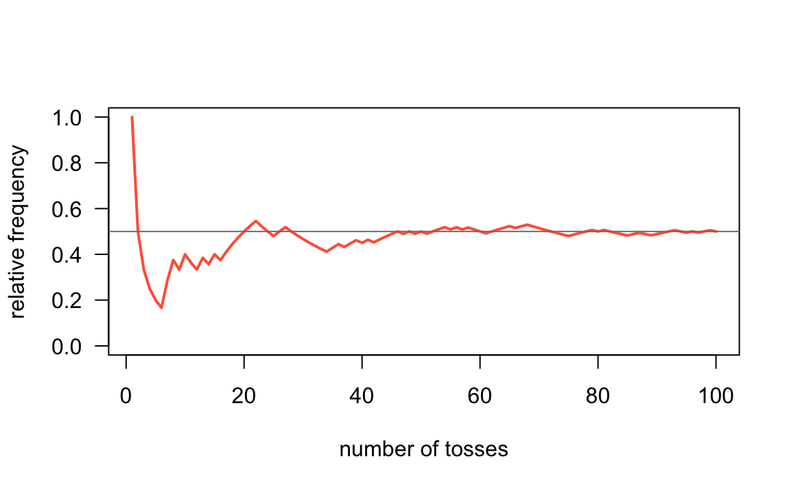

--- 
title: "Pack YouR Code"
author: "Gaston Sanchez"
date: ""
description: "This book showcases a basic example of how to create an R package based on S3 classes."
site: bookdown::bookdown_site
documentclass: book
bibliography: [book.bib, packages.bib]
biblio-style: apalike
link-citations: yes
colorlinks: yes
graphics: yes
fontsize: 12pt
cover-image: images/pack-your-code-logo.png
---


# Welcome {-}


- __Pack YouR Code__ by Gaston Sanchez.
- Copyright 2018-2021. All rights reserved.


## Full Edition {-}

The full edition (in PDF and EPUB formats) can be purchased at leanpub:

https://leanpub.com/packyourcode


## Preview Edition {-}

This is now a preview of the first four chapters:

1) [Let's Toss a Coin](#intro)
2) [Tossing Function](#function)
3) [Coin Objects](#aboutpls)
4) [Methods (part 1)](#timeline)
5) Object toss
6) Methods (part 2)
7) Additional Methods
8) Toy Package
9) Filestructure
10) Description File
11) Namespace
12) Vignettes
13) Package States
14) Packaging Flow
15) Sharing


## Preface {-}

The ultimate goal of this book is to teach you how to create a relatively simple 
R package based on the so-called S3 classes. 

The chapters of the book are organized in four major parts:

- The first part involves describing a motivating example about using R to write 
code for tossing a coin. We begin tackling this problem from a 
_classic programming_ style (as opposed to a more object-oriented style).

- The second part is dedicated to implement code in a more object-oriented 
programming (OOP) fashion by using S3-class objects. Keep in mind that the S3 
system is a very informal OOP approach. However, it is the most common system 
among the universe of R packages.

- The third part discusses the anatomy of an R package, and how the various 
files are organized in a formal filestructure. The purpose of this part is to
review the main type of directories, subdirectories, and files ina package, as 
well as some usual components that are worth including in a package. 

- The fourth part of the book has to do with the actual process of building 
a package. We describe the differrent possible states, showing an opinionated 
flow for building a package.


### About this book {-}

The main reason for me to write this book was the lack of a teaching resource 
that I could use with the students in my computational statistics courses at the 
University of California Berkeley (e.g. Stat 133, 159, 243, 259). Not only I 
saw the need, but also the opportunity, to refine a couple of tutorial documents 
that I had written for those courses. I hope that this book can help not only 
students in my courses but also many other useRs that are interested in creating 
R packages.

This book assumes a couple of things about you: familiarity with R in general, 
and more specifically with RStudio. You should have used `.R` (R script) and 
`.Rmd` (R markdwon) files before. You don't need to be an expert useR but you 
do need to feel comfortable working with various data structures: vectors, 
factors, arrays, matrices, lists, data frames, etc. Also, I assume that you have 
some basic programming experience: for example, you know how to create simple 
functions, you know how to use conditional structures like `if-then-else`, as 
well as loop structures such as `for()` loops or `while()` loops. And that you 
also have some experience writing tests of functions (ideally using the package 
`"testthat"`).


### Other Resources {-}

This is NOT a comprehensive text that covers every single aspect about creating 
R packages. Instead, I've written this book more in the spirit of an extended 
tutorial or guide document with a relatively simple working example.

If you are interested in the nitty gritty aspects about R packages, then you 
should read Hadley Wickham's excellent book on 
__[R Packages](http://r-pkgs.had.co.nz/package.html)__. In fact, in various 
chapters of _Pack YouR Code_, I will be constantly referring to the book 
_R Packages_ in the form of links like this: `r-pkgs: topic`; for example: 
[r-pkgs: Introduction](http://r-pkgs.had.co.nz/intro.html).

I also recommend reading Friedrich Leisch's manuscript 
__[Creating R Packages: A Tutorial](https://cran.r-project.org/doc/contrib/Leisch-CreatingPackages.pdf)__. 
Personally, this tutorial helped me a lot to successfully complete creating my 
first R package in the spring of 2009, after several (enormously frustrating) 
failed attempts during 2007 and 2008. It's impressive to have witnessed how the 
package-creation process has been made more smooth since those years.

Another classic book with material about R packages is 
__Software for Data Analysis__ by John Chamber, the "master mind" behind the S 
language, on which the R language is based on.

If _R Packages_ is not enough for you, and you are still curious about more 
obscure and esoteric details, then you need to check the technical R manual 
__[Writing R Extensions](https://cran.r-project.org/doc/manuals/r-release/R-exts.html)__ 
(by the R Core Team). I should warn you: this is NOT a beginner friendly document.


<!--chapter:end:index.Rmd-->


# (PART) Motivation {-}

# Let's Toss a Coin {#intro}

To illustrate the concepts behind object-oriented programming in R, we are going 
to consider a classic chance process (or chance experiment) of flipping a coin.


In this chapter you will learn how to implement code in R that simulates tossing 
a coin one or more times.


## Coin object

Think about a standard coin with two sides: _heads_ and _tails_.

<div class="figure" style="text-align: center">

<p class="caption">(\#fig:unnamed-chunk-5)two sides of a coin</p>
</div>

To toss a coin using R, we first need an object that plays the role of a coin. 
How do you create such a coin? Perhaps the simplest way to create a coin with 
two sides, `"heads"` and `"tails"`, is with a character vector via the _combine_ 
function `c()`:


```r
# a (virtual) coin object
coin <- c("heads", "tails")
coin
#> [1] "heads" "tails"
```

You can also create a _numeric_ coin that shows `1` and `0` instead of
`"heads"` and `"tails"`:


```r
num_coin <- c(1, 0)
num_coin
#> [1] 1 0
```

Likewise, you can also create a _logical_ coin that shows `TRUE` and `FALSE` 
instead of `"heads"` and `"tails"`:


```r
log_coin <- c(TRUE, FALSE)
log_coin
#> [1]  TRUE FALSE
```


## Tossing a coin

Once you have an R object that represents a _coin_, the next step involves 
learning how to simulate tossing the coin.

The important thing to keep in mind is that tossing a coin is a random 
experiment: you either get heads or tails. One way to simulate the action of 
tossing a coin in R is with the function `sample()` which lets you draw random 
samples, with or without replacement, of the elements in the input vector. 

Here's how to simulate a coin toss using `sample()` to take a random sample of 
size 1 of the elements in `coin`:


```r
# toss a coin
coin <- c('heads', 'tails')

sample(coin, size = 1)
#> [1] "heads"
```

You use the argument `size = 1` to specify that you want to take a sample of 
size 1 from the input vector `coin`.


### Random Samples

By default, `sample()` takes a sample of the specified `size` 
__without replacement__. If `size = 1`, it does not really matter whether the 
sample is done with or without replacement. 

To draw two elements __without__ replacement, use `sample()` like this:


```r
# draw 2 elements without replacement
sample(coin, size = 2)
#> [1] "heads" "tails"
```

This is equivalent to calling `sample()` with the argument `replace = FALSE`:


```r
sample(coin, size = 2, replace = FALSE)
#> [1] "tails" "heads"
```

What if you try to toss the coin three or four times?


```r
# trying to toss coin 3 times (produces an error)
sample(coin, size = 3)
```

Notice that R produced an error message:

```
Error in sample.int(length(x), size, replace, prob): cannot take a 
sample larger than the population when 'replace = FALSE'
```

This is because the default behavior of `sample()` cannot draw more elements 
than the length of the input vector.

To be able to draw more elements, you need to sample __with replacement__, which 
is done by specifying the argument `replace = TRUE`, like this:


```r
# draw 4 elements with replacement
sample(coin, size = 4, replace = TRUE)
#> [1] "heads" "tails" "heads" "tails"
```


## The Random Seed

The way `sample()` works is by taking a random sample from the input vector. 
This means that every time you invoke `sample()` you will likely get a different 
output. For instance, when we run the following command twice, the output of 
the first call is different from the output in the second call, even though the
command is exactly the same in both cases:


```r
# five tosses
sample(coin, size = 5, replace = TRUE)
#> [1] "tails" "tails" "heads" "tails" "heads"
```


```r
# another five tosses
sample(coin, size = 5, replace = TRUE)
#> [1] "heads" "tails" "tails" "heads" "heads"
```


In order to make the examples replicable (so you can get the same output as mine), 
you need to specify what is called a __random seed__. This is done with the 
function `set.seed()`. By setting a _seed_, every time you use one of the random 
generator functions, like `sample()`, you will get the same values.


```r
# set random seed
set.seed(1257)

# toss a coin with replacement
sample(coin, size = 4, replace = TRUE)
#> [1] "tails" "heads" "heads" "tails"
```


## Sampling with different probabilities

Last but not least, `sample()` comes with the argument `prob` which allows you 
to provide specific probabilities for each element in the input vector.

By default, `prob = NULL`, which means that every element has the same probability 
of being drawn. In the example of tossing a coin, the command `sample(coin)` is 
equivalent to `sample(coin, prob = c(0.5, 0.5))`. In the latter case we 
explicitly specify a probability of 50% chance of heads, and 50% chance of tails:


```r
# tossing a fair coin
coin <- c("heads", "tails")

sample(coin)
#> [1] "tails" "heads"

# equivalent
sample(coin, prob = c(0.5, 0.5))
#> [1] "tails" "heads"
```

However, you can provide different probabilities for each of the elements in the 
input vector. For instance, to simulate a __loaded__ coin with chance of heads 
20%, and chance of tails 80%, set `prob = c(0.2, 0.8)` like so:


```r
# tossing a loaded coin (20% heads, 80% tails)
sample(coin, size = 5, replace = TRUE, prob = c(0.2, 0.8))
#> [1] "heads" "tails" "tails" "tails" "tails"
```


### Simulating tossing a coin

Now that we have all the elements to toss a coin with R, let's simulate flipping 
a coin 100 times, and then use the function `table()` to count the resulting 
number of `"heads"` and `"tails"`:


```r
# number of flips
num_flips <- 100

# flips simulation
coin <- c('heads', 'tails')
flips <- sample(coin, size = num_flips, replace = TRUE)

# number of heads and tails
freqs <- table(flips)
freqs
#> flips
#> heads tails 
#>    50    50
```

In my case, I got 50 heads and 50 tails. Your results will 
probably be different than mine. Sometimes you will get more `"heads"`, sometimes 
you will get more `"tails"`, and sometimes you will get exactly 50 `"heads"` 
and 50 `"tails"`.

Let's run another series of 100 flips, and find the frequency of `"heads"` and 
`"tails"` with the help of the `table()` function:


```r
# one more 100 flips
flips <- sample(coin, size = num_flips, replace = TRUE)
freqs <- table(flips)
freqs
#> flips
#> heads tails 
#>    50    50
```


To make things more interesting, let's consider how the frequency of `heads` 
evolves over a series of _n_ tosses (in this case _n_ = `num_flips`).


```r
heads_freq <- cumsum(flips == 'heads') / 1:num_flips
```

With the vector `heads_freq`, we can graph the (cumulative) relative frequencies 
with a line-plot:


```r
plot(heads_freq,      # vector
     type = 'l',      # line type
     lwd = 2,         # width of line
     col = 'tomato',  # color of line
     las = 1,         # orientation of tick-mark labels
     ylim = c(0, 1),  # range of y-axis
     xlab = "number of tosses",    # x-axis label
     ylab = "relative frequency")  # y-axis label
abline(h = 0.5, col = 'gray50')
```

<div class="figure" style="text-align: center">

<p class="caption">(\#fig:unnamed-chunk-19)Cumulative relative frequencies of heads</p>
</div>


<!--chapter:end:01-introduction.Rmd-->


# Tossing Function {#function}

## Introduction

In the previous chapter we wrote code to simulate tossing a coin multiple times. 
First we created a virtual `coin` as a two-element vector. Secondly, we discussed 
how to use the function `sample()` to obtain a sample of a given size, with and
without replacement. And finally we put everything together: a `coin` object 
passed to `sample()`, to simulate tossing a coin.


```r
# tossing a coin 5 times
coin <- c("heads", "tails")
sample(coin, size = 5, replace = TRUE)
#> [1] "tails" "heads" "tails" "tails" "tails"
```

Our previous code works and we could get various sets of tosses of different 
sizes: 10 tosses, or 50, or 1000, or more:


```r
# various sets of tosses
flips1 <- sample(coin, size = 1, replace = TRUE)
flips10 <- sample(coin, size = 10, replace = TRUE)
flips50 <- sample(coin, size = 50, replace = TRUE)
flips1000 <- sample(coin, size = 1000, replace = TRUE)
```

As you can tell, even a single toss requires using the command 
`sample(coin, size = 1, replace = TRUE)` which is a bit long and requires some 
typing. Also, notice that we are repeating the call of `sample()` several times. 
This is the classic indication that we should instead write a function to 
encapsulate our code and reduce repetition.


## A `toss()` function

Let's make things a little bit more complex but also more interesting. Instead 
of calling `sample()` every time we want to toss a coin, we can write a 
dedicated `toss()` function, something like this:


```r
# toss function (version 1)
toss <- function(x, times = 1) {
  sample(x, size = times, replace = TRUE)
}
```

Recall that, to define a new function in R, you use the function `function()`. 
You need to specify a name for the function, and then assign `function()` to the 
chosen name. You also need to define optional arguments, which are basically the
inputs of the function. And of course, you must write the code (i.e. the body) 
so the function does something when you use it. In summary:

- Generally, you give a name to a function.

- A function takes one or more inputs (or none), known as _arguments_.

- The expressions forming the operations comprise the __body__ of the function.

- Usually, you wrap the body of the functions with curly braces.

- A function returns a single value.

Once defined, you can use `toss()` like any other function in R:


```r
# basic call
toss(coin)
#> [1] "tails"

# toss 5 times
toss(coin, 5)
#> [1] "heads" "tails" "heads" "tails" "tails"
```

Because we can make use of the `prob` argument inside `sample()`, we can make 
the `toss()` function more versatile by adding an argument that let us specify 
different probabilities for each side of a coin:


```r
# toss function (version 2)
toss <- function(x, times = 1, prob = NULL) {
  sample(x, size = times, replace = TRUE, prob = prob)
}

# fair coin (default)
toss(coin, times = 5)
#> [1] "heads" "heads" "heads" "tails" "tails"

# laoded coin
toss(coin, times = 5, prob = c(0.8, 0.2))
#> [1] "heads" "heads" "heads" "tails" "heads"
```


## Documenting Functions

You should strive to always include _documentation_ for your functions. In fact, 
writing documentation for your functions should become second nature. What does 
this mean? Documenting a function involves adding descriptions for the purpose 
of the function, the inputs it accepts, and the output it produces. 

- Description: what the function does

- Input(s): what are the inputs or arguments

- Output: what is the output or returned value

You can find some inspiration in the `help()` documentation when your search 
for a given function: e.g. `help(mean)`

A typical way to write documentation for a function is by adding comments for 
things like the description, input(s), output(s), like in the code below:


```r
# Description: tosses a coin
# Inputs
#   x: coin object (a vector)
#   times: how many times
#   prob: probability values for each side
# Output
#   vector of tosses
toss <- function(x, times = 1, prob = NULL) {
  sample(x, size = times, replace = TRUE, prob = prob)
}
```


## Roxygen Comments

I'm going to take advantage of our `toss()` function to introduce __Roxygen__ 
comments. As you know, the hash symbol `#` has a special meaning in R: you use 
it to indicate comments in your code. Interestingly, there is a special kind of 
comment called an "R oxygen" comment, or simply _roxygen_ comment. As any R 
comment, Roxygen comments are also indicated with a hash; unlike standard 
comments, Roxygen comments have an appended apostrophe: `#'`.

You use Roxygen comments to write documentation for your functions. Let's see 
an example and then I will explain what's going on with the roxygen comments:


```r
#' @title Coin toss function 
#' @description Simulates tossing a coin a given number of times
#' @param x coin object (a vector)
#' @param times number of tosses
#' @param prob vector of probabilities for each side of the coin
#' @return vector of tosses
toss <- function(x, times = 1, prob = NULL) {
  sample(x, size = times, replace = TRUE, prob = prob)
}
```

If you type the above code in an R script, or inside a coce chunk of a dynamic 
document (e.g. `Rmd` file), you should be able to see how RStudio highlights 
Roxygen keywords such as `@title` and `@description`. Here's a screenshot of 
what the code looks like in my computer:

<div class="figure" style="text-align: center">

<p class="caption">(\#fig:unnamed-chunk-24)Highlighted keywords of roxygen comments</p>
</div>

Notice that each keyword of the form `@word` appears in blue (yours may be in a 
different color depending on the highlighting scheme that you use). Also notice 
the different color of each parameter (`@param`) name like `x`, `times`, and `prob`. 

If you look at the code of other R packages, it is possible to find Roxygen 
documentation in which there is no `@title` and `@description`, something like 
this:


```r
#' Coin toss function
#'
#' Simulates tossing a coin a given number of times
#'
#' @param x coin object (a vector)
#' @param times number of tosses
#' @param prob vector of probabilities for each side of the coin
#' @return vector of tosses
toss <- function(x, times = 1, prob = NULL) {
  sample(x, size = times, replace = TRUE, prob = prob)
}
```

When you see Roxygen comments like the above ones, the text in the first line 
is treated as the `@title` of the function, and then the text after the empty 
line is considered to be the `@description`. Notice how both lines of text have 
an empty line below them!

The `@return` keyword is optional. But I strongly recommend including `@return` 
because it is part of a function's documentation: title, description, inputs, 
and output.


### About Roxygen Comments

At this point you may be asking yourself: "Do I really need to document my 
functions with roxygen comments?" The short answer is No; you don't. So why 
bother? Because royxgen comments are very convenient when you take a set of 
functions that will be used to build an R package. In later chapters we will 
describe more details about roxygen comments and roxygen keywords. The way we 
are going to build a package involves running some functions that will take the 
content of the roxygen comments into account and use them to generate what is 
called `Rd` (R-dcoumentation) files. These are actually the files behind all 
the help (or manual) documentation pages of any function.


<!--chapter:end:02-functions.Rmd-->


# (PART) Classes and Methods {-}

# Coin Objects {#coin}

## Introduction

In this chapter we describe how to create object classes in R. Specifically, we 
will focus on the so-called __S3 classes__ or S3 system. This is one of the 
three types of Object Oriented (OO) systems available in R, and it is the most 
common among R packages.


## Objects and Classes

In the previous chapter we learned how to create a `toss()` function, and also 
how to document it with roxygen comments. So far, we have the following code:


```r
#' Coin toss function
#'
#' Simulates tossing a coin a given number of times
#'
#' @param x coin object (a vector)
#' @param times number of tosses
#' @param prob vector of probabilities for each side of the coin
#' @return vector of tosses
toss <- function(x, times = 1, prob = NULL) {
  sample(x, size = times, replace = TRUE, prob = prob)
}
```

We can invoke `toss()` to generate a first series of five tosses, and then 
compute the total proportion of heads:


```r
# random seed
set.seed(534)

# five tosses
five <- toss(coin, times = 5)
five
#> [1] "tails" "tails" "tails" "heads" "heads"

# proportion of heads in five
sum(five == "heads") / length(five)
#> [1] 0.4
```

We can also get a second series of tosses, but this time involving tossing a 
coin six times. Similarly, we compute the total proportion of heads:


```r
# six tosses
six <- toss(coin, times = 6)
six
#> [1] "heads" "heads" "heads" "tails" "heads" "tails"

# prop of heads in six
sum(six == "heads") / length(five)
#> [1] 0.8
```

The above code works ... except that there is an error; the number of heads in 
`six` is being divided by 5 instead of 6. R hasn't detected this error: it 
doesn't know that the division has to be done using `length(six)`.

Wouldn't it be prefarable to have some mechanism that prevented this type of 
error from happening? Bugs will always be part of any programming activity, but 
it is better to minimize certain types of errors like the one above.


## S3 Classes

R has two (plus one) object oriented systems, so it can be a bit intimidatin 
gwhen you read and learn about them for the first time. The goal of this 
section is not to make you an expert in all R's OO systems, but to help you 
become familiar with the so-called "S3 class".

__S3__ implements a style of object oriented programming called 
_generic-function OO_. S3 uses a special type of function called a _generic_ 
function that decides which method to call. Keep in mind that S3 is a very 
casual system: it does not really have a formal definition of classes.

S3 classes are widely-used, in particular for statistical models in the 
`"stats"` package. S3 classes are very informal in that there is not a formal 
definition for an S3 class. Usually, S3 objects are built on top of lists, or 
atomic vectors with attributes. But you can also turn functions into S3 objects.

Note that in more formal OOP languages, all functions are associated with a 
class, while in R, only some are.


### Making an object

To make an object an instance of a class, you just take an existing base object 
and set a `"class"` attribute for it. You can do that during creation of the 
object with the function `structure()` and its `class` argument. For example, 
we can create an object of class `"coin"` like so:


```r
# object coin via structure()
coin1 <- structure(c("heads", "tails"), class = "coin") 
coin1
#> [1] "heads" "tails"
#> attr(,"class")
#> [1] "coin"
```

You can also create an object first, and then specify its class with the 
homonym function `class()`:


```r
# object coin via class()
coin2 <- c("heads", "tails")
class(coin2) <- "coin"
coin2
#> [1] "heads" "tails"
#> attr(,"class")
#> [1] "coin"
```

As any object in R, you can inspect the class of objects `coin1` and `coin2` 
with the `class()` function:


```r
class(coin1)
#> [1] "coin"

class(coin2)
#> [1] "coin"
```

You can also determine if an object inherits from a specific class using 
`inherits()`


```r
inherits(coin2, "coin")
#> [1] TRUE
```

Having a `"coin"` object, we can pass it to the `toss()` function to simulate 
flipping the coin:


```r
toss(coin1, times = 5)
#> [1] "heads" "heads" "heads" "tails" "tails"
```


## A more robust `"coin"` class

Let's review our class `"coin"`. The way we defined a coin object was like this:


```r
# object coin
coin1 <- c("heads", "tails")
class(coin1) <- "coin" 
```

While this definition is good to illustrate the concept of an object, its class,
and how to define generic methods, it is a very loose-defined class. One could 
create a `"coin"` out of `c('tic', 'tac', 'toe')`, and then use `toss()` on it:


```r
ttt <- c('tic', 'tac', 'toe')
class(ttt) <- "coin"

toss(ttt)
#> [1] "tic"
```

We need a more formal definition of a coin object. For instance, it makes more 
sense to require that a coin should only have two sides. In this way, a vector 
like `ttt` would not be a valid coin.

For convenience purposes, we can define a __class constructor__ function to
initialize a `"coin"` object:


```r
# constructor function (version 1)
coin <- function(object = c("heads", "tails")) {
  class(object) <- "coin"
  object
}

# default coin
coin()
#> [1] "heads" "tails"
#> attr(,"class")
#> [1] "coin"

# another coin
coin(c("h", "t"))
#> [1] "h" "t"
#> attr(,"class")
#> [1] "coin"
```

Think of this type of function as an auxiliary function that you can use to
generate a default object of class `coin`.


## Improving `"coin"` objects

To implement the requirement that a coin must have two sides, we can add an 
`if()` condition to the constructor function in order to check for the length 
of the input vector. If the length of the input object is different from two,
then we stop execution; otherwise we proceed with the creation of a `coin` 
object.


```r
# constructor function (version 2)
coin <- function(object = c("heads", "tails")) {
  if (length(object) != 2) {
    stop("\n'object' must be of length 2")
  }
  class(object) <- "coin"
  object
}
```

Let's try our modified constructor function `coin()` to create a virtual version 
of the US penny like the one in the image below:

<div class="figure" style="text-align: center">

<p class="caption">(\#fig:unnamed-chunk-32)Example of a US penny (www.usacoinbook.com)</p>
</div>


```r
# US penny
penny <- coin(c("lincoln", "shield"))
penny
#> [1] "lincoln" "shield" 
#> attr(,"class")
#> [1] "coin"
```


Now let's try `coin()` with an invalid input vector. In this case, the constructor function will `stop()` execution with an error message because the input argument has more than 2 elements.


```r
# invalid coin
ttt <- c('tic', 'tac', 'toe')
coin(ttt)
#> Error in coin(ttt): 
#> 'object' must be of length 2
```


### Attributes

Notice how everytime you print the name of a `"coin"` object, its class is 
displayed in the form of `attr(,"class")`.


```r
penny
#> [1] "lincoln" "shield" 
#> attr(,"class")
#> [1] "coin"
```

Interestingly, an R object can have multiple attributes. Right now our `coin`
objects have just one attribute---its class. But we can add more attributes if
we want to. For example, we could add an attribute `prob`. Let's see why and how.

Recall that the `toss()` function simulates flips using `sample()`. Also, recall
that one of the arguments of `sample()` is `prob` which lets you specify 
probabilities for each of the elements in the input vector. In order to take 
advantage of `sample()`'s argument `prob`, and being able to create _loaded_ 
(i.e. biased) coins, we can add an attribute to our coin object to specify 
probabilities for each of its sides. 

In other words, in addition to the `class` attribute of a coin, the idea is to 
assign another attribute for the probability values. We can do this by adding a 
`prob` argument to the constructor function, and then pass it as an attribute 
of the coin object inside the class-constructor function. Here's how:


```r
# constructor function (version 3)
coin <- function(object=c("heads", "tails"), prob=c(0.5, 0.5)) {
  if (length(object) != 2) {
    stop("\n'object' must be of length 2")
  }
  attr(object, "prob") <- prob
  class(object) <- "coin"
  return(object)
}

coin()
#> [1] "heads" "tails"
#> attr(,"prob")
#> [1] 0.5 0.5
#> attr(,"class")
#> [1] "coin"
```

In the previous code, the `prob` argument takes a vector of probabilities for 
each element in `object`. This vector is passed to `object` via the function 
`attr()` inside the body of `coin()`. Notice the use of a default argument 
`prob = c(0.5, 0.5)`, that is, a _fair_ coin by default. 


### Using a list

Another way to implement a constructor function `coin()` that returns an object 
containing values for both the _sides_ and the _probabilities_, is to use an R 
list. Here's the code for this option:


```r
# constructor function (version 4)
coin <- function(sides=c("heads", "tails"), prob=c(0.5, 0.5)) {
  if (length(sides) != 2) {
    stop("\n'sides' must be of length 2")
  }
  res <- list(sides = sides, prob = prob)
  class(res) <- "coin"
  return(res)
}

coin()
#> $sides
#> [1] "heads" "tails"
#> 
#> $prob
#> [1] 0.5 0.5
#> 
#> attr(,"class")
#> [1] "coin"
```

Personally, I prefer this latter option because it allows you to create more
complex objects as an R list. The important detail is to assign the name of a 
class to the created object with the function `class()`.


### Auxiliary Checker Function

Once again, while constructing an object of class `"coin"` we need to check its
validity which involves checking for the validity of `prob`. We basically need 
to check that `prob` and its elements meet the following requirements:

- must be numeric and of length 2

- probability values must be between 0 and 1

- the sum of these values must add up to 1

Here is one possible function to verify the aspects of `prob` listed above: 


```r
check_prob <- function(prob) {
  if (length(prob) != 2 | !is.numeric(prob)) {
    stop("\n'prob' must be a numeric vector of length 2")
  }
  if (any(prob < 0) | any(prob > 1)) {
    stop("\n'prob' values must be between 0 and 1")
  }
  if (sum(prob) != 1) {
    stop("\nelements in 'prob' must add up to 1")
  }
  TRUE
}
```

Note that I'm adding a `TRUE` statement at the end of the function. This is just 
an auxiliary value to determine whether the function returns a valid `prob`. 

Now let's test `check_prob` with _valid_ and _invalid_ values:


```r
# Valid -----------------------
check_prob(c(0.5, 0.5))
#> [1] TRUE

check_prob(c(0.1, 0.9))
#> [1] TRUE

check_prob(c(1/3, 2/3))
#> [1] TRUE

check_prob(c(1/3, 6/9))
#> [1] TRUE
```


```r
# Invalid -----------------------
# bad length
check_prob(1)
#> Error in check_prob(1): 
#> 'prob' must be a numeric vector of length 2

# bad length
check_prob(c(0.1, 0.2, 0.3))
#> Error in check_prob(c(0.1, 0.2, 0.3)): 
#> 'prob' must be a numeric vector of length 2

# negative probability
check_prob(c(-0.2, 0.8))
#> Error in check_prob(c(-0.2, 0.8)): 
#> 'prob' values must be between 0 and 1

# what should we do in this case?
check_prob(c(0.33, 0.66))     
#> Error in check_prob(c(0.33, 0.66)): 
#> elements in 'prob' must add up to 1
```


With the definition of the checker function `check_prob()`, we keep refining
our constructor function `coin()`:


```r
# constructor function (version 5)
coin <- function(sides=c("heads", "tails"), prob=c(0.5, 0.5)) {
  if (length(sides) != 2) {
    stop("\n'sides' must be of length 2")
  }
  check_prob(prob)
  res <- list(sides = sides, prob = prob)
  class(res) <- "coin"
  return(res)
}

coin1 <- coin()
coin1
#> $sides
#> [1] "heads" "tails"
#> 
#> $prob
#> [1] 0.5 0.5
#> 
#> attr(,"class")
#> [1] "coin"
```


## Print Method for `"coin"` Objects

Every time you type in the name of an object `"coin"`, like our `penny` example, 
the output is displayed in a default, "quick and dirty", way. In this case R 
simply displays the values associated to the sides and their probabilities like 
any other list:


```r
# US penny
penny <- coin(c("lincoln", "shield"))
penny
#> $sides
#> [1] "lincoln" "shield" 
#> 
#> $prob
#> [1] 0.5 0.5
#> 
#> attr(,"class")
#> [1] "coin"
```

Sometimes the default displayed output is all you need. However, there are 
occasions in which you need to customize the amount and format of information 
displayed on the screen when you type in the name of an object.

Instead of keeping the default printed values, it would be nice to print `penny` 
and see some _cleaner_ output, perhaps something like this:

```
object "coin"

        side  prob
1  "lincoln"   0.5
2   "shield"   0.5
```

How can we obtain such type of printed output? The answer involves writing a 
`print` method for objects of class `"coin"`. Because `print()` is actually a 
generic function, what you need to do is to create a a specific print _flavor_ 
for class `"coin"`. Basically, you define a `print.coin()` function, and then 
include commands to print information in the desired way:


```r
# print method for objects of class "coin"
print.coin <- function(x) {
  cat('object "coin"\n\n')
  cd <- data.frame(
    side = x$sides, prob = x$prob
  )
  print(cd)
  invisible(x)
}
```

The next time you print the name of an object of class `"coin"`, R will 
look for a `print` method (which now exists) and dispatch such method.


```r
penny
#> object "coin"
#> 
#>      side prob
#> 1 lincoln  0.5
#> 2  shield  0.5
```

If you look at the code of `print.coin()`, you'll notice that I've decided to 
use `cat()` to display a short text letting the user know that the printed 
object is a `"coin"` object. Also, I'm assembling a data frame with the 
`sides` and `prob` vectors so that their content looks nicely organized in a 
tabular format when printed by R.


## Extending classes

We can extend the class `"coin"` and create a derived class for special types 
of coins. For instance, say we want to create a class `"quarter"`. One side of 
the coin refers to George Washington, while the other side refers to the bald 
eagle:

https://en.wikipedia.org/wiki/Quarter_(United_States_coin)

We can create a quarter by first starting with a `coin()` of `sides` 
_washington_ and _bald-eagle_, and then assign a `"quarter"` class:


```r
quarter1 <- coin(c("washington", "bald-eagle")) 
class(quarter1) <- c("quarter", "coin")
quarter1
#> object "coin"
#> 
#>         side prob
#> 1 washington  0.5
#> 2 bald-eagle  0.5
```

Interestingly, our coin `quarter1` inherits from `"coin"`:


```r
inherits(quarter1, "coin")
#> [1] TRUE
```

In other words, `quartier1` is of class `"quarter"` but it is also a `"coin"` 
object.

Likewise, we can create a class for a slightly unbalanced `"dime"`:


```r
dime1 <- coin(c("roosevelt", "torch"), prob = c(0.48, 0.52))
class(dime1) <- c("dime", "coin")
dime1
#> object "coin"
#> 
#>        side prob
#> 1 roosevelt 0.48
#> 2     torch 0.52
```

Here's another coin example with a _peso_ from Mexico (where I grew up). When 
you flip a _peso_, mexicans don't really talk about about _cara_ (heads) or 
_cruz_ (tail). Instead, they say _aguila_ (eagle) or _sol_ (sun):


```r
peso <- coin(c("aguila", "sol")) 
class(peso) <- c("peso", "coin")
peso
#> object "coin"
#> 
#>     side prob
#> 1 aguila  0.5
#> 2    sol  0.5
```


<!--chapter:end:03-coin.Rmd-->


# Methods (part 1) {#methods1}

## Introduction

Having seen how to create S3 objects, in this chapter you will learn about how
to create methods for S3 objects.


## Improving `toss()`

From [chapter 2](#function), we ended up with the following `toss()` function:


```r
#' @title Coin toss function 
#' @description Simulates tossing a coin a given number of times
#' @param x coin object (a vector)
#' @param times number of tosses
#' @param prob vector of probabilities for each side of the coin
#' @return vector of tosses
toss <- function(x, times = 1, prob = NULL) {
  sample(x, size = times, replace = TRUE, prob = prob)
}
```

The issue with the way `toss()` has been defined so far, is that you can provide 
any type of input vector (not necessarily of class `"coin"`), and it will still 
work. For instance, let's bring back the vector `c('tic', 'tac', 'toe')` and
use it as an input for `toss()`


```r
toss(c('tic', 'tac', 'toe'))
#> [1] "toe"
```

The reason why `toss()` works with pretty much any vector, is because we are 
not checking for the validity of the input vector. That is, currently we are
not enforcing the input vector to be an object of class `"coin"`.

To create a function `toss()` that only works for objects of class `"coin"`, we 
could add a `stop()` condition that checks if the argument `x` is of the right 
class:


```r
toss <- function(x, times = 1, prob = NULL) {
  if (class(x) != "coin") {
    stop("\ntoss() requires an object 'coin'")
  }
  sample(x$sides, size = times, replace = TRUE, prob = prob)
}

# ok
toss(coin1)
#> [1] "tails"

# bad coin
toss(c('tic', 'tac', 'toe'))
#> Error in toss(c("tic", "tac", "toe")): 
#> toss() requires an object 'coin'
```


A more formal strategy, and one that follows OOP principles, is to create a 
toss __method__. In R, many functions are actually methods: e.g. `print()`, 
`summary()`, `plot()`, `str()`, etc. Out of curiosity, you can simply type the
name of the function---without parenthesis---and confirm that `print()` is a 
method


```r
# print method
print
#> function (x, ...) 
#> UseMethod("print")
#> <bytecode: 0x7fee91a8c368>
#> <environment: namespace:base>
```

The second line in the above output indicates `UseMethod("print")`, which is 
the way R tells you that `print` is a generic method. In fact, if you look at 
the manual documentation of `print()`, in the _Description_ section you will 
see the following information

> `print` prints its argument and returns it invisibly (via `invisible(x)`). 
> It is a generic function which means that new printing methods can be easily 
> added for new classes.

A function that is a generic method is not really one unique function but a 
collection or family of functions for printing objects, computing summaries, 
plotting, etc. Depending on the class of the object, a generic method will look 
for a specific function for that class. For example, objects of class `"matrix"`
have several methods; to see the collection of available methods for this type
of object use the `methods()` function:


```r
# methods for objects "matrix"
methods(class = "matrix")
#>  [1] anyDuplicated as.data.frame as.raster     boxplot       coerce       
#>  [6] determinant   duplicated    edit          head          initialize   
#> [11] isSymmetric   Math          Math2         Ops           relist       
#> [16] subset        summary       tail          unique       
#> see '?methods' for accessing help and source code
```


## Generic Method `toss`

Let's see how to to create methods for our coin tossing working example.
When implementing new methods, you begin by creating a __generic__ method with 
the function `UseMethod()`:


```r
# generic method 'toss'
toss <- function(x, ...) UseMethod("toss")
```

The function `UseMethod()` allows you to declare the name of a method. In this 
example we are telling R that the function `toss()` is now a generic `"toss"` 
method. Note the use of `"..."` in the function definition, this will allow you 
to include more arguments when you define specific methods based on `"toss"`. 

A generic method alone is not very useful. You need to create specific cases for 
the generic. In our example, we only have one class `"coin"`, so that is the 
only class we will allow `toss` to be applied on. The way to do this is by 
defining `toss.coin()`:


```r
# specific method 'toss' for objects "coin"
toss.coin <- function(x, times = 1, prob = NULL) {
  sample(x$sides, size = times, replace = TRUE, prob = prob)
}
```

The name of the method, `"toss"`, comes first, followed by a dot `"."`, followed 
by the name of the class, `"coin"`. Notice that the body of the function 
`toss.coin()` does not include the `stop()` command anymore.

To use the `toss()` method on a `"coin"` object, you don't really have to call 
`toss.coin()`; calling `toss()` is enough:


```r
toss(coin1)
#> [1] "tails"
```

How does `toss()` work? Becasue `toss()` is now a generic method, everytime you 
use it, R will look at the class of the input, and see if there is an associated 
`"toss"` method. In the previous example, `coin1` is an object of class `"coin"`, 
for which there is a specific `toss.coin()` method. Thus using `toss()` on a 
`"coin"` object works fine. 

Now let's try `toss()` on the character vector `c('tic', 'tac', 'toe')`:


```r
# no toss() method for regular vectors
toss(c('tic', 'tac', 'toe'))
#> Error in UseMethod("toss"): no applicable method for 'toss' applied to an object of class "character"
```

When you try to use `toss()` on an object that is not of class `"coin"`, you get 
a nice error message like the one below

```
Error in UseMethod("toss"): no applicable method for 'toss' 
applied to an object of class "character"
```

Because an object `"coin"` already contains an element `prob`, the `toss.coin()` 
function does not really need an argument `prob`. Instead, we can pass this 
value from the coin object. Here's a new definition of `toss.coin()`:


```r
toss.coin <- function(x, times = 1) {
  sample(x$sides, size = times, replace = TRUE, prob = x$prob)
}
```

Let's toss a loaded coin:


```r
set.seed(2341)
loaded_coin <- coin(c('HEADS', 'tails'), prob = c(0.75, 0.25))
toss(loaded_coin, times = 6)
#> [1] "HEADS" "HEADS" "HEADS" "HEADS" "HEADS" "tails"
```


<!--chapter:end:04-methods1.Rmd-->


# (PART) Package Structure {-}

# (PART) Packaging {-}

<!--chapter:end:05-preview.Rmd-->

