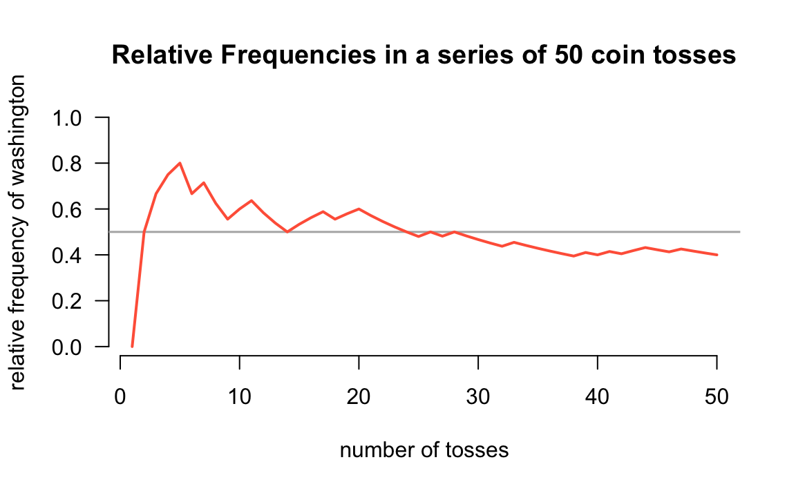

--- 
title: "Pack YouR Code"
author: "Gaston Sanchez"
date: ""
site: bookdown::bookdown_site
documentclass: book
bibliography: [book.bib, packages.bib]
biblio-style: apalike
link-citations: yes
description: "Basic example of how to create an R package based on S3 classes."
---


# Welcome {-}


The ultimate goal of this book is to teach you how to create a relatively simple R package based on the so-called S3 classes. 

The chapters of the book are organized in three major parts:

- The first part involves describing a motivating example about using R to write code for tossing a coin. We begin tackling this problem from a _classic programming_ style (as opposed to a more object-oriented style).

- The second part is dedicated to implement code in a more object-oriented programming (OOP) fashion by using S3-class objects. Keep in mind that the S3 system is a very informal OOP approach. However, it is the most common system among the universe of R packages.

- The third part of the book has to do with the actual process of organizing the R code into a formal package. We discuss the anatomy of a package, its differrent possible states, some usual components that are worth including in a package, and the flow for building a package.


### About this book {-}

The main reason to write this book was the lack of a teaching resource that I could use with the students in my computational statistics courses at the University of California Berkeley (e.g. Stat 133, 159, 243, 259). Not only I saw the need, but also the opportunity, to refine a couple of tutorial documents that I had written for those courses. I hope that this book can help not only students in my courses but also many other useRs that are interested in creating R packages.

This book assumes a couple of things about you: familiarity with R in general, and more specifically with RStudio. You should have used `.R` (R script) and `.Rmd` (R markdwon) files before. You don't need to be an expert useR but you do need to feel comfortable working with various data structures: vectors, factors, arrays, matrices, lists, data frames, etc. Also, I assume that you have some basic programming experience: for example, you know how to create simple functions, you know how to use conditional structures like `if-then-else`, as well as loop structures such as `for()` loops or `while()` loops. And that you also have some experience writing tests of functions (ideally using the package `"testthat"`).


### Other Resources {-}

This is NOT a comprehensive text that covers every single aspect about creating R packages. Instead, I've written this book more in the spirit of an extended tutorial or guide document with a relatively simple working example.

If you are interested in the nitty gritty aspects about R packages, then you should read Hadley Wickham's excellent book on __[R Packages](http://r-pkgs.had.co.nz/package.html)__. In fact, in various chapters of _Pack YouR Code_, I will be constantly referring to the book _R Packages_ in the form of links like this: `r-pkgs: topic`; for example: [r-pkgs: Introduction](http://r-pkgs.had.co.nz/intro.html).

I also recommend reading Friedrich Leisch's manuscript __[Creating R Packages: A Tutorial](https://cran.r-project.org/doc/contrib/Leisch-CreatingPackages.pdf)__. Personally, this tutorial helped me a lot to successfully complete creating my first R package in the spring of 2009, after several (enormously frustrating) failed attempts during 2007 and 2008. It's impressive to have witnessed how the package-creation process has been made more smooth since those years.

Another classic book with material about R packages is __Software for Data Analysis__ by John Chamber, the "master mind" behind the S language, on which the R language is based on.

If _R Packages_ is not enough for you, and you are still curious about more obscure and esoteric details, then you need to check the technical R manual __[Writing R Extensions](https://cran.r-project.org/doc/manuals/r-release/R-exts.html)__ (by the R Core Team). I should warn you: this is NOT a beginner friendly document.


-----


<a rel="license" href="http://creativecommons.org/licenses/by-nc-sa/4.0/"></a><br />This work, by [Gaston Sanchez](http://gastonsanchez.com), is licensed under a <a rel="license" href="http://creativecommons.org/licenses/by-nc-sa/4.0/">Creative Commons Attribution-NonCommercial-ShareAlike 4.0 International License</a>.

<!--chapter:end:index.Rmd-->


# (PART) Motivation {-}

# Let's toss a coin {#intro}

To illustrate the concepts behind object-oriented programming in R, we are going to consider a classic chance process (or chance experiment) of flipping a coin.


In this chapter you will learn how to implement code in R that simulates tossing a coin one or more times.


## Coin object

Think about a standard coin with two sides: _heads_ and _tails_.

<div class="figure" style="text-align: center">

<p class="caption">(\#fig:unnamed-chunk-5)two sides of a coin</p>
</div>

To toss a coin using R, we first need an object that plays the role of a coin. How do you create such a coin? Perhaps the simplest way to create a coin with two sides, `"heads"` and `"tails"`, is with a character vector via the _combine_ function `c()`:


```r
# a (virtual) coin object
coin <- c("heads", "tails")
coin
#> [1] "heads" "tails"
```

You can also create a _numeric_ coin that shows `1` and `0` instead of
`"heads"` and `"tails"`:


```r
num_coin <- c(1, 0)
num_coin
#> [1] 1 0
```

Likewise, you can also create a _logical_ coin that shows `TRUE` and `FALSE` 
instead of `"heads"` and `"tails"`:


```r
log_coin <- c(TRUE, FALSE)
log_coin
#> [1]  TRUE FALSE
```


## Tossing a coin

Once you have an object that represents the _coin_, the next step involves learning how to simulate tossing the coin.

Tossing a coin is a random experiment: you either get heads or tails. One way to simulate the action of tossing a coin in R is with the function `sample()` which lets you draw random samples, with or without replacement, of the elements of an input vector. 

Here's how to simulate a coin toss using `sample()` to take a random sample of size 1 of the elements in `coin`:


```r
# toss a coin
coin <- c('heads', 'tails')

sample(coin, size = 1)
#> [1] "tails"
```

You use the argument `size = 1` to specify that you want to take a sample of size 1 from the input vector `coin`.


### Random Samples

By default, `sample()` takes a sample of the specified `size` __without replacement__. If `size = 1`, it does not really matter whether the sample is done with or without replacement. 

To draw two elements WITHOUT replacement, use `sample()` like this:


```r
# draw 2 elements without replacement
sample(coin, size = 2)
#> [1] "tails" "heads"
```

What if you try to toss the coin three or four times?


```r
# trying to toss coin 3 times
sample(coin, size = 3)
#> Error in sample.int(length(x), size, replace, prob): cannot take a sample larger than the population when 'replace = FALSE'
```

Notice that R produced an error message. This is because the default behavior of `sample()` cannot draw more elements than the length of the input vector.

To be able to draw more elements, you need to sample __with replacement__, which is done by specifying the argument `replace = TRUE`, like this:


```r
# draw 4 elements with replacement
sample(coin, size = 4, replace = TRUE)
#> [1] "tails" "heads" "tails" "heads"
```


## The Random Seed

The way `sample()` works is by taking a random sample from the input vector. This means that every time you invoke `sample()` you will likely get a different output.


```r
# five tosses
sample(coin, size = 5, replace = TRUE)
#> [1] "tails" "tails" "heads" "heads" "tails"
```


```r
# another five tosses
sample(coin, size = 5, replace = TRUE)
#> [1] "heads" "heads" "tails" "heads" "heads"
```


In order to make the examples replicable (so you can get the same output as mine), you need to specify what is called a __random seed__. This is done with the function `set.seed()`. By setting a _seed_, every time you use one of the random generator functions, like `sample()`, you will get the same values.


```r
# set random seed
set.seed(1257)

# toss a coin with replacement
sample(coin, size = 4, replace = TRUE)
#> [1] "heads" "tails" "heads" "heads"
```


## Sampling with different probabilities

Last but not least, `sample()` comes with the argument `prob` which allows you to provide specific probabilities for each element in the input vector.

By default, `prob = NULL`, which means that every element has the same probability of being drawn. In the example of tossing a coin, the command `sample(coin)` is equivalent to `sample(coin, prob = c(0.5, 0.5))`. In the latter case we explicitly specify a probability of 50% chance of heads, and 50% chance of tails:


```r
# tossing a fair coin
coin <- c("heads", "tails")

sample(coin)
#> [1] "tails" "heads"

# equivalent
sample(coin, prob = c(0.5, 0.5))
#> [1] "tails" "heads"
```

However, you can provide different probabilities for each of the elements in the input vector. For instance, to simulate a __loaded__ coin with chance of heads 20%, and chance of tails 80%, set `prob = c(0.2, 0.8)` like so:


```r
# tossing a loaded coin (20% heads, 80% tails)
sample(coin, size = 5, replace = TRUE, prob = c(0.2, 0.8))
#> [1] "heads" "tails" "tails" "tails" "tails"
```


### Simulating tossing a coin

Now that we have all the elements to toss a coin with R, let's simulate flipping a coin 100 times, and then use the function `table()` to count the resulting number of `"heads"` and `"tails"`:


```r
# number of flips
num_flips <- 100

# flips simulation
coin <- c('heads', 'tails')
flips <- sample(coin, size = num_flips, replace = TRUE)

# number of heads and tails
freqs <- table(flips)
freqs
#> flips
#> heads tails 
#>    56    44
```

In my case, I got 56 heads and 44 tails. Your results will probably be different than mine. Sometimes you will get more `"heads"`, sometimes you will get more `"tails"`, and sometimes you will get exactly 50 `"heads"` and 50 `"tails"`.

Let's run another series of 100 flips, and find the frequency of `"heads"` and `"tails"` with the help of the `table()` function:


```r
# one more 100 flips
flips <- sample(coin, size = num_flips, replace = TRUE)
freqs <- table(flips)
freqs
#> flips
#> heads tails 
#>    47    53
```


To make things more interesting, let's consider how the frequency of `heads` evolves over a series of _n_ tosses (in this case _n_ = `num_flips`).


```r
heads_freq <- cumsum(flips == 'heads') / 1:num_flips
```

With the vector `heads_freq`, we can graph the (cumulative) relative frequencies with a line-plot:


```r
plot(heads_freq,      # vector
     type = 'l',      # line type
     lwd = 2,         # width of line
     col = 'tomato',  # color of line
     las = 1,         # orientation of tick-mark labels
     ylim = c(0, 1),  # range of y-axis
     ylab = "relative frequency")  # y-axis label
abline(h = 0.5, col = 'gray50')
```


<!--chapter:end:introduction.Rmd-->


# Tossing Function {#function}

## Introduction

In the previous chapter we wrote code to simulate tossing a coin multiple times. First we created a virtual `coin` as a two-element vector. Secondly, we discussed the function `sample()` to obtain a sample, with replacement, of a given size. And finally we put everything together: a `coin` object passed to `sample()`, to simulate tossing a coin.


```r
# tossing a coin 5 times
coin <- c("heads", "tails")
sample(coin, size = 5, replace = TRUE)
#> [1] "heads" "heads" "tails" "tails" "heads"
```

Our previous code works and we could get various sets of tosses of different sizes: 10 tosses, or 50, or 1000, or more:


```r
# various sets of tosses
flips1 <- sample(coin, size = 1, replace = TRUE)
flips10 <- sample(coin, size = 10, replace = TRUE)
flips50 <- sample(coin, size = 50, replace = TRUE)
flips1000 <- sample(coin, size = 1000, replace = TRUE)
```

As you can tell, even a single toss requires using the command `sample(coin, size = 1, replace = TRUE)` which is a bit long and requires some typing. Also, notice that we are repeating the call of `sample()` several times. This is the classic indication that we should instead write a function to encapsulate our code and reduce repetition.


## A `toss()` function

Let's make things a little bit more complex but also more interesting. Instead of calling `sample()` every time we want to toss a coin, we can write a `toss()` function, something like this:


```r
# toss function (version 1)
toss <- function(x, times = 1) {
  sample(x, size = times, replace = TRUE)
}
```

Recall that, to define a new function in R, you use the function `function()`. You need to specify a name for the function, and then assign `function()` to the chosen name. You also need to define optional arguments (i.e. inputs). And of course, you must write the code (i.e. the body) so the function does something when you use it. In summary:

- Generally, you give a name to a function.
- A function takes one or more inputs (or none), known as _arguments_.
- The expressions forming the operations comprise the __body__ of the function.
- Usually, you wrap the body of the functions with curly braces.
- A function returns a single value.

Once defined, you can use `toss()` like any other function in R:


```r
# basic call
toss(coin)
#> [1] "heads"

# toss 5 times
toss(coin, 5)
#> [1] "tails" "tails" "tails" "heads" "tails"
```

Because we can make use of the `prob` argument inside `sample()`, we can make the `toss()` function more versatile by adding an argument that let us specify different probabilities for each side of a coin:


```r
# toss function (version 2)
toss <- function(x, times = 1, prob = NULL) {
  sample(x, size = times, replace = TRUE, prob = prob)
}

# fair coin (default)
toss(coin, times = 5)
#> [1] "heads" "tails" "heads" "heads" "heads"

# laoded coin
toss(coin, times = 5, prob = c(0.8, 0.2))
#> [1] "heads" "heads" "heads" "tails" "heads"
```


## Documenting Functions

You should strive to always include _documentation_ for your functions. In fact, writing documentation for your functions should become second nature. What does this mean? Documenting a function involves adding descriptions for the purpose of the function, the inputs it accepts, and the output it produces. 

- Description: what the function does
- Input(s): what are the inputs or arguments
- Output: what is the output (returned value)

You can find some inspiration in the `help()` documentation when your search for a given function: e.g. `help(mean)`

A typical way to write documentation for a function is by adding comments for things like the description, input(s), output(s), like in the code below:


```r
# Description: tosses a coin
# Inputs
#   x: coin object (a vector)
#   times: how many times
#   prob: probability values for each side
# Output
#   vector of tosses
toss <- function(x, times = 1, prob = NULL) {
  sample(x, size = times, replace = TRUE, prob = prob)
}
```


## Roxygen Comments

I'm going to take advantage of our first function to introduce __Roxygen__ comments. As you know, the hash symbol `#` has a special meaning in R: you use it to indicate comments in your code. Interestingly, there is a special kind of comment called an "R oxygen" comment, or simply _roxygen_ comment. As any R comment, Roxygen comments are also indicated with a hash; unlike standard comments, Roxygen comments have an appended apostrophe: `#'`.

You use Roxygen comments to write documentation for your functions. Let's see an example and then I will explain what's going on with the special comments:


```r
#' @title Coin toss function 
#' @description Simulates tossing a coin a given number of times
#' @param x coin object (a vector)
#' @param times number of tosses
#' @param prob vector of probabilities for each side of the coin
#' @return vector of tosses
toss <- function(x, times = 1, prob = NULL) {
  sample(x, size = times, replace = TRUE, prob = prob)
}
```

If you type the above code in an R script, or inside a coce chunk of a dynamic document (e.g. `Rmd` file), you should be able to see how RStudio highlights Roxygen keywords such as `@title` and `@description`. Here's a screenshot of what the code looks like in my machine:


Notice that each keyword of the form `@word` appears in blue (yours may be in a different color depending on the highlighting scheme that you use). Also notice the different color of each parameter (`@param`) name like `x`, `times`, and `prob`. 

If you look at the code of other R packages, it is possible to find Roxygen documentation in which there is no `@title` and `@description`, something like this:


```r
#' Coin toss function
#'
#' Simulates tossing a coin a given number of times
#'
#' @param x coin object (a vector)
#' @param times number of tosses
#' @param prob vector of probabilities for each side of the coin
#' @return vector of tosses
toss <- function(x, times = 1, prob = NULL) {
  sample(x, size = times, replace = TRUE, prob = prob)
}
```

When you see Roxygen comments like the above ones, the text in the first line is treated as the `@title` of the function, and then the text after the empty line is considered to be the `@description`. Notice how both lines of text have an empty line below them!

The `@return` keyword is optional. But I strongly recommend including `@return` because it is part of a function's documentation: tile, description, inputs, and output.


### About Roxygen Comments

At this point you may be asking yourself: "Do I really need to document my functions with roxygen comments?" The short answer is No; you don't. So why bother? Because royxgen comments are very convenient when you take a set of functions that will be used to build an R package. In later chapters we will describe more details about roxygen comments and roxygen keywords. The way we are going to build a package involves running some functions that will take the content of the roxygen comments and use them to generate what is called `Rd` (R-dcoumentation) files. These are actually the files behind all the help (or manual) documentation pages of any function.


<!--chapter:end:functions.Rmd-->


# (PART) Classes {-}

# Coin Objects {#coin}

## Introduction

In this chapter we describe how to create object classes in R. Specifically, we will focus on the so-called __S3 classes__ or S3 system.
This is one of the three types of Object Oriented (OO) systems available in R, and it is the most common among R packages.


## Objects and Classes

In the previous chapter we learned how to create a `toss()` function, and also how to document it with roxygen comments. We can invoke `toss()` to generate a first series of five tosses, and then compute the proportion of heads:


```r
# random seed
set.seed(534)

# five tosses
five <- toss(coin, times = 5)
five
#> [1] "heads" "heads" "tails" "tails" "heads"

# proportion of heads in five
sum(five == "heads") / length(five)
#> [1] 0.6
```

We can also get a second series of tosses, but this time involving tossing a coin six times. Similarly, we compute the proportion of heads:


```r
# six tosses
six <- toss(coin, times = 6)
six
#> [1] "tails" "heads" "heads" "heads" "tails" "heads"

# prop of heads in six
sum(six == "heads") / length(five)
#> [1] 0.8
```

The above code works ... except that there is an error; the number of heads in `six` is being divided by 5 instead of 6. R hasn't detected this error: it doesn't know that the division has to be done using `length(six)`.

Wouldn't it be prefarable to have some mechanism that prevented this type of error from happening? Bugs will always be part of any programming activity, but it is better to minimize certain types of errors like the one above.


## S3 Classes

R has two (plus one) object oriented systems, so it can be a bit intimidatin gwhen you read and learn about them for the first time. 
The goal of this tutorial is not to make you an expert in all R's OO systems, but to help you become familiar with the so-called _S3 class_.

__S3__ implements a style of object oriented programming called generic-function OO. S3 uses a special type of function called a _generic_ function that decides which method to call. Keep in mind that S3 is a very casual system: it does not really have a formal definition of classes.

S3 classes are widely-used, in particular for statistical models in the `"stats"` package. S3 classes are very informal in that there is not a formal definition for an S3 class. Usually, S3 objects are built on top of lists, or atomic vectors with attributes. But you can also turn functions into S3 objects.

Note that in more formal OOP languages, all functions are associated with a class, while in R, only some are.


### Making an object

To make an object an instance of a class, you just take an existing base object and set the `"class"` attribute. You can do that during creation of the object with `structure()`


```r
# object coin via structure()
coin1 <- structure(c("heads", "tails"), class = "coin") 
coin1
#> [1] "heads" "tails"
#> attr(,"class")
#> [1] "coin"
```

You can also create an object first, and then specify its class with the function `class()`:


```r
# object coin via class()
coin2 <- c("heads", "tails")
class(coin2) <- "coin"
coin2
#> [1] "heads" "tails"
#> attr(,"class")
#> [1] "coin"
```

As any object in R, you can inspect the class `coin1`, and `coin2` with the `class()` function:


```r
class(coin1)
#> [1] "coin"

class(coin2)
#> [1] "coin"
```

You can also determine if an object inherits from a specific class using `inherits()`


```r
inherits(coin2, "coin")
#> [1] TRUE
```

Having a `"coin"` object, we can pass it to the `toss()` function to simulate flipping the coin:


```r
toss(coin1, times = 5)
#> [1] "tails" "heads" "heads" "heads" "heads"
```


## A more robust `"coin"` class

Let's review our class `"coin"`. The way we defined a coin object was like this:


```r
# object coin
coin1 <- c("heads", "tails")
class(coin1) <- "coin" 
```

While this definition is good to illustrate the concept of an object, its class, and how to define generic methods, it is a very loose-defined class. One could create a `"coin"` out of `c('tic', 'tac', 'toe')`, and then use `toss()` on it:


```r
ttt <- c('tic', 'tac', 'toe')
class(ttt) <- "coin"

toss(ttt)
#> [1] "tic"
```

We need a more formal definition of a coin. For instance, it makes more sense to require that a coin should only have two sides. In this way, the vector `ttt` would not be a valid coin.

For convenience purposes, we can define a __class constructor__ function to
initialize a `"coin"` object:


```r
# constructor function (version 1)
coin <- function(object = c("heads", "tails")) {
  class(object) <- "coin"
  object
}

# default coin
coin()
#> [1] "heads" "tails"
#> attr(,"class")
#> [1] "coin"

# another coin
coin(c("h", "t"))
#> [1] "h" "t"
#> attr(,"class")
#> [1] "coin"
```


## Improving `"coin"` objects

To implement the requirement that a coin must have two sides, we can add an _if_ condition to check for the length of the input vector:


```r
# constructor function (version 2)
coin <- function(object = c("heads", "tails")) {
  if (length(object) != 2) {
    stop("\n'object' must be of length 2")
  }
  class(object) <- "coin"
  object
}
```

Let's try our modified constructor function `coin()` to create a virtual version of the US penny like the one in the image below:

<div class="figure" style="text-align: center">

<p class="caption">(\#fig:unnamed-chunk-30)US Penny (www.usacoinbook.com)</p>
</div>


```r
# US penny
penny <- coin(c("lincoln", "shield"))
penny
#> [1] "lincoln" "shield" 
#> attr(,"class")
#> [1] "coin"
```

Now let's try `coin()` with an invalid input vector. In this case, the constructor function will `stop()` execution with an error message because the input argument has more than 2 elements.


```r
# invalid coin
ttt <- c('tic', 'tac', 'toe')
coin(ttt)
#> Error in coin(ttt): 
#> 'object' must be of length 2
```


Because the `toss()` function simulates flips using `sample()`, we can take advantage of the argument `prob` to specify probabilities for each side of the coin. In this way, we can create _loaded_ (i.e. biased) coins. 

The way we are going to keep the probability of each side of the coin is with the use an objetc's attributes. An example of an attribute is the class of an object. For example the class of our `"coin"` objects:


```r
penny
#> [1] "lincoln" "shield" 
#> attr(,"class")
#> [1] "coin"
```

Notice how everytime you print the name of a `"coin"` object, its class is displayed in the form of `attr(,"class")`.


### Attributes

In addition to the class attribute of a coin, the idea is to assign another attribute for the probability values. We can do this by adding a `prob` argument to the constructor function, and then pass it as an attribute of the coin object inside the class-constructor function.


```r
# constructor function (version 3)
coin <- function(object = c("heads", "tails"), prob = c(0.5, 0.5)) {
  if (length(object) != 2) {
    stop("\n'object' must be of length 2")
  }
  attr(object, "prob") <- prob
  class(object) <- "coin"
  return(object)
}

coin()
#> [1] "heads" "tails"
#> attr(,"prob")
#> [1] 0.5 0.5
#> attr(,"class")
#> [1] "coin"
```

In the previous code, the `prob` argument takes a vector of probabilities for each element in `object`. This vector is passed to `object` via the function `attr()` inside the body of `coin()`. Notice the use of a default `prob = c(0.5, 0.5)`, that is, a _fair_ coin by default. 


### Using a list

Another way to implement a constructor function `coin()` that returns an object containing values for both the sides and the probabilities, is to use an R list. Here's the code for this option:


```r
# constructor function (version 4)
coin <- function(sides = c("heads", "tails"), prob = c(0.5, 0.5)) {
  if (length(sides) != 2) {
    stop("\n'sides' must be of length 2")
  }
  res <- list(sides = sides, prob = prob)
  class(res) <- "coin"
  return(res)
}

coin()
#> $sides
#> [1] "heads" "tails"
#> 
#> $prob
#> [1] 0.5 0.5
#> 
#> attr(,"class")
#> [1] "coin"
```


### Auxiliary Checker

Once again, we need to check for the validity of `prob`. We basically need to check that `prob` and its elements meet the following requirements:

- must be numeric and of length 2
- probability values must be between 0 and 1
- the sum of these values must add up to 1

Here is one possible function to check the aspects of `prob` listed above: 


```r
check_prob <- function(prob) {
  if (length(prob) != 2 | !is.numeric(prob)) {
    stop("\n'prob' must be a numeric vector of length 2")
  }
  if (any(prob < 0) | any(prob > 1)) {
    stop("\n'prob' values must be between 0 and 1")
  }
  if (sum(prob) != 1) {
    stop("\nelements in 'prob' must add up to 1")
  }
  TRUE
}
```

Note that I'm adding a `TRUE` statement at the end of the function. This is just an auxiliary value to know if the function returns a valid `prob`. Now let's test it with _valid_ and _invalid_ values:


```r
# Valid -----------------------
check_prob(c(0.5, 0.5))
#> [1] TRUE
check_prob(c(0.1, 0.9))
#> [1] TRUE
check_prob(c(1/3, 2/3))
#> [1] TRUE
check_prob(c(1/3, 6/9))
#> [1] TRUE
```


```r
# Invalid -----------------------
# bad length
check_prob(1)
#> Error in check_prob(1): 
#> 'prob' must be a numeric vector of length 2
# bad length
check_prob(c(0.1, 0.2, 0.3))
#> Error in check_prob(c(0.1, 0.2, 0.3)): 
#> 'prob' must be a numeric vector of length 2
# negative probability
check_prob(c(-0.2, 0.8))
#> Error in check_prob(c(-0.2, 0.8)): 
#> 'prob' values must be between 0 and 1
# what should we do in this case?
check_prob(c(0.33, 0.66))     
#> Error in check_prob(c(0.33, 0.66)): 
#> elements in 'prob' must add up to 1
```


Here's the improved constructor function `coin()`:


```r
# constructor function (version 5)
coin <- function(sides = c("heads", "tails"), prob = c(0.5, 0.5)) {
  if (length(sides) != 2) {
    stop("\n'sides' must be of length 2")
  }
  check_prob(prob)
  res <- list(sides = sides, prob = prob)
  class(res) <- "coin"
  return(res)
}

coin1 <- coin()
coin1
#> $sides
#> [1] "heads" "tails"
#> 
#> $prob
#> [1] 0.5 0.5
#> 
#> attr(,"class")
#> [1] "coin"
```


## Print Method for `"coin"`

Every time you type in the name of an object `"coin"`, like our `penny` example, the output is displayed in a default, "quick and dirty", way. R displays the values associated to the sides and their probabilities like any other list:


```r
# US penny
penny <- coin(c("lincoln", "shield"))
penny
#> $sides
#> [1] "lincoln" "shield" 
#> 
#> $prob
#> [1] 0.5 0.5
#> 
#> attr(,"class")
#> [1] "coin"
```

Sometimes the default displayed output is all you need. However, there are occasions in which you need to customize the amount and format of information displayed on the screen when you type in the name of an object.

Instead of keeping the default printed values, it would be nice to print `penny` and see some _cleaner_ output like this:

```
object "coin"

        side  prob
1  "lincoln"   0.5
2   "shield"   0.5
```

How can we do this? The answer involves writing a `print` method for objects of class `"coin"`. Because `print()` is actually a generic function, what you need to do is to create a a specific print _flavor_ for class `"coin"`. Basically, you define a `print.coin()` function, and then include commands to print information in the desired way:


```r
# print method for objects of class "coin"
print.coin <- function(x) {
  cat('object "coin"\n\n')
  cd <- data.frame(
    side = x$sides, prob = x$prob
  )
  print(cd)
  invisible(x)
}
```

Now, the next time you print the name of an object of class `"coin"`, R will look for a `print` method (which now exists) and dispatch such method.


```r
penny
#> object "coin"
#> 
#>      side prob
#> 1 lincoln  0.5
#> 2  shield  0.5
```


## Extending classes

We can extend the class `"coin"` and create a derived class for special types of coins. For instance, say we want to create a class `"quarter"`. One side of the coin refers to George Washington, while the other side refers to the bald eagle:

https://en.wikipedia.org/wiki/Quarter_(United_States_coin)

We can create a quarter by first starting with a `coin()` of `sides` _washington_ and _bald-eagle_, and then assign a `"quarter"` class:


```r
quarter1 <- coin(c("washington", "bald-eagle")) 
class(quarter1) <- c("quarter", "coin")
quarter1
#> object "coin"
#> 
#>         side prob
#> 1 washington  0.5
#> 2 bald-eagle  0.5
```

Interestingly, our coin `quarter1` inherits from `"coin"`:


```r
inherits(quarter1, "coin")
#> [1] TRUE
```

In other words, `quartier1` is of class `"quarter"` but it is also a `"coin"` object.

Likewise, we can create a class for a slightly unbalanced `"dime"`:


```r
dime1 <- coin(c("roosevelt", "torch"), prob = c(0.48, 0.52))
class(dime1) <- c("dime", "coin")
dime1
#> object "coin"
#> 
#>        side prob
#> 1 roosevelt 0.48
#> 2     torch 0.52
```

Here's another coin example, a _peso_, from Mexico (where I grew up). When you flip a _peso_, mexicans will talk about two sides: _aguila_ (eagle) or _sol_ (sun):


```r
peso <- coin(c("aguila", "sol")) 
class(peso) <- c("peso", "coin")
peso
#> object "coin"
#> 
#>     side prob
#> 1 aguila  0.5
#> 2    sol  0.5
```

<!--chapter:end:coin.Rmd-->


# (PART) Methods {-}

# Methods (part 1) {#methods1}

## Introduction

We describe our methods in this chapter.


## Improving `toss()`

From [chapter 2](#function), we ended up with the following `toss()` function:


```r
#' @title Coin toss function 
#' @description Simulates tossing a coin a given number of times
#' @param x coin object (a vector)
#' @param times number of tosses
#' @param prob vector of probabilities for each side of the coin
#' @return vector of tosses
toss <- function(x, times = 1, prob = NULL) {
  sample(x, size = times, replace = TRUE, prob = prob)
}
```

The issue with the way `toss()` has been defined so far, is that you can pass it any type of vector (not necessarily of class `"coin"`), and it will still work:


```r
toss(c('tic', 'tac', 'toe'))
#> [1] "tac"
```


To create a function `toss()` that only works for objects of class `"coin"`, we could add a `stop()` condition that checks if the argument `x` is of the right class:


```r
toss <- function(x, times = 1, prob = NULL) {
  if (class(x) != "coin") {
    stop("\ntoss() requires an object 'coin'")
  }
  sample(x$sides, size = times, replace = TRUE, prob = prob)
}

# ok
toss(coin1)
#> [1] "heads"

# bad coin
toss(c('tic', 'tac', 'toe'))
#> Error in toss(c("tic", "tac", "toe")): 
#> toss() requires an object 'coin'
```


A more formal strategy, and one that follows OOP principles, is to create a toss __method__. In R, many functions are actually methods: e.g. `print()`, `summary()`, `plot()`, `str()`, etc. 


```r
# print method
print
#> function (x, ...) 
#> UseMethod("print")
#> <bytecode: 0x7fcd63e9c628>
#> <environment: namespace:base>
```

These types of functions are not really one unique function, they typically comprise a collection or family of functions for printing objects, computing summaries, plotting, etc. Depending on the class of the object, a generic method will look for a specific function for that class:


```r
# methods for objects "matrix"
methods(class = "matrix")
#>  [1] anyDuplicated as.data.frame as.raster     boxplot       determinant  
#>  [6] duplicated    edit          head          isSymmetric   relist       
#> [11] subset        summary       tail          unique       
#> see '?methods' for accessing help and source code
```


## Generic Method `toss`

When implementing new methods, you begin by creating a __generic__ method with the function `UseMethod()`:


```r
# generic method 'toss'
toss <- function(x, ...) UseMethod("toss")
```

The function `UseMethod()` allows you to declare the name of a method. In this example we are telling R that the function `toss()` is now a generic `"toss"` method. Note the use of `"..."` in the function definition, this will allow you to include more arguments when you define specific methods based on `"toss"`. 

A generic method alone is not very useful. You need to create specific cases for the generic. In our example, we only have one class `"coin"`, so that is the only class we will allow `toss` to be applied on. The way to do this is by defining `toss.coin()`:


```r
# specific method 'toss' for objects "coin"
toss.coin <- function(x, times = 1, prob = NULL) {
  sample(x$sides, size = times, replace = TRUE, prob = prob)
}
```

The name of the method, `"toss"`, comes first, followed by a dot `"."`, followed by the name of the class, `"coin"`. Notice that the body of the function `toss.coin()` does not include the `stop()` command anymore.

To use the `toss()` method on a `"coin"` object, you don't really have to call `toss.coin()`; calling `toss()` is enough:


```r
toss(coin1)
#> [1] "tails"
```

How does `toss()` work? Becasue `toss()` is now a generic method, everytime you use it, R will look at the class of the input, and see if there is an associated `"toss"` method. In the previous example, `coin1` is an object of class `"coin"`, for which there is a specific `toss.coin()` method. Thus using `toss()` on a `"coin"` object works fine. 

Now let's try `toss()` on the character vector `c('tic', 'tac', 'toe')`:


```r
# no toss() method for regular vectors
toss(c('tic', 'tac', 'toe'))
#> Error in UseMethod("toss"): no applicable method for 'toss' applied to an object of class "character"
```

When you try to use `toss()` on an object that is not of class `"coin"`, you get a nice error message.


Because an object `"coin"` already contains an element `prob`, the `toss.coin()` function does not really an argument `prob`. Instead, we can pass this value from the coin object.
Here's a new definition of `toss.coin()`:


```r
toss.coin <- function(x, times = 1) {
  sample(x$sides, size = times, replace = TRUE, prob = x$prob)
}
```

Let's toss a loaded coin:


```r
set.seed(2341)
loaded_coin <- coin(c('HEADS', 'tails'), prob = c(0.75, 0.25))
toss(loaded_coin, times = 6)
#> [1] "HEADS" "HEADS" "HEADS" "HEADS" "HEADS" "tails"
```

<!--chapter:end:methods1.Rmd-->


# Object toss {#toss}

## Introduction

Let's keep improving our function `toss()`, but now changing its output in order to return an object of class `"toss"`.


## Motivation for object `"toss"`

So far we have a constructor function `coin()` (from [chapter 3](#function)) and a `toss()` (from [chapter 4](#methods1)) which actually corresponds to the `toss` _method_ for objects of class `"coin"`:


```r
# constructor function
coin <- function(sides = c("heads", "tails"), prob = c(0.5, 0.5)) {
  if (length(sides) != 2) {
    stop("\n'sides' must be of length 2")
  }
  check_prob(prob)
  res <- list(sides = sides, prob = prob)
  class(res) <- "coin"
  return(res)
}
```


```r
# toss method for "coin" objects
toss.coin <- function(x, times = 1) {
  sample(x$sides, size = times, replace = TRUE, prob = x$prob)
}
```

Let's use `toss()` to flip a coin 10 times:


```r
set.seed(321)

acoin <- coin(c('heads', 'tails'))

toss10 <- toss(acoin, times = 10)
toss10
#>  [1] "heads" "heads" "tails" "tails" "tails" "tails" "tails" "tails"
#>  [9] "tails" "heads"
```

Having obtained several tosses, we can calculate things like:

1) the total number of tosses
2) the total number of `heads`
3) the total number of `tails`


```r
# number of tosses
length(toss10)
#> [1] 10

# total number of heads
sum(toss10 == 'heads')
#> [1] 3

# total number of tails
sum(toss10 == 'tails')
#> [1] 7
```

In general, when tossing a coin, we are not only interested in keeping track of such tosses; we would also like to know (or keep track of) the number of tosses, the number of heads, and the number of tails. Consequently, it would be nice to have another class of object for this purpose.

How do you know that you need this new object class? 

Well, this is precisely an example that illustrates the process of programming in general, and OOP in particular. This kind of decisions require some (or sometimes "a lot" of) thinking, and brainstorming time. To be honest, while I was writing this book and playing with `"coin"` objects and their tosses, I decided that it would be convenient to have an object of class `"toss"` containing the following information:

- all the outcomes from the series of tosses
- the total number of tosses
- the total number of heads
- the total number of tails

The most flexible type of data structure in R to store other data structures is a `list`. Having a vector of tosses, we can use a list to keep all the desired information:


```r
flips <- toss(coin1, times = 6)

a <- list(
  tosses = flips, 
  total = length(flips),
  heads = sum(flips == coin1$sides[1]),
  tails = sum(flips == coin1$sides[2])
)

a
#> $tosses
#> [1] "heads" "tails" "heads" "tails" "heads" "tails"
#> 
#> $total
#> [1] 6
#> 
#> $heads
#> [1] 3
#> 
#> $tails
#> [1] 3
```

The idea is to be able to invoke `toss()`, and then obtain an object like the list `a` in the above code. But do it in such a way that the output is an object of class `"toss"`.


### Auxiliary Constructor

For convenience purposes, we can write an __auxiliary constructor__ function, which I will call `make_toss()`. This function will take an input vector (i.e. a character vector with `"heads"` and `"tails"` elements), and it will return an object of class `"toss"`:


```r
# auxiliary constructor function
make_toss <- function(coin, flips) {
  res <- list(
    coin = coin,
    tosses = flips,
    total = length(flips),
    heads = sum(flips == coin$sides[1]),
    tails = sum(flips == coin$sides[2]))
  class(res) <- "toss"
  res
}
```

This auxiliary function is not intended to be called by the user. Instead, it's an _internal_ function for auxiliary purposes.


## Main Function `toss()`

Now that we have the auxiliary function `make_toss()`, we can integrate it inside the specific method `toss.coin()`. In this way, the function `toss.coin()` becomes the _master_ function: the one designed to be called by the user:


```r
# redefining toss.coin()
toss.coin <- function(x, times = 1) {
  flips <- sample(x$sides, size = times, replace = TRUE, prob = x$prob)
  make_toss(x, flips)
}
```

This is how `toss()` works:


```r
set.seed(2233)
fair <- coin()
toss(fair, times = 5)
#> $coin
#> object "coin"
#> 
#>    side prob
#> 1 heads  0.5
#> 2 tails  0.5
#> 
#> $tosses
#> [1] "tails" "tails" "tails" "heads" "heads"
#> 
#> $total
#> [1] 5
#> 
#> $heads
#> [1] 2
#> 
#> $tails
#> [1] 3
#> 
#> attr(,"class")
#> [1] "toss"
```

You may ask: "Why do we need a function `make_toss()`, and another function `toss()`?". Can't we just write a single function `suppertoss()` that does everything at once?:


```r
# can't we just put everything in one function?
supertoss <- function(x, times = 1) {
  flips <- toss(x, times = times)
  res <- list(
    coin = x,
    tosses = flips,
    total = length(flips),
    heads = sum(flips == x$sides[1]),
    tails = sum(flips == x$sides[2]))
  class(res) <- "toss"
  res
}
```

The short answer is: yes, you can. And probably this is what most beginners tend to do. The reason why I decided to break things down into simpler and smaller functions is because I went already through a couple of implementations, and realized that it was better to have the auxiliary function `make_toss()`. Also, it is good practice to write short functions that preferably do one thing. 

Here's a brief recap of the main functions we have so far:

- `coin()` is a constructor function to create objects of class `"coin"`.
- `toss()` is a generic `"toss"` method.
- `make_toss()` is an auxiliary function that takes a `"coin"` and a vector of 
flips, and which produces an object `"toss"`.
- `toss.coin()` is the specific `"toss"` method to be used on `"coin"` objects.
- notice that `make_toss()` is called by `toss.coin()`.


## Upgrading `toss()`

Let's consider our `quarter` coin, and apply `toss()` on it:


```r
quarter1 <- coin(c("washington", "fort")) 
class(quarter1) <- c("quarter", "coin")
quarter1
#> object "coin"
#> 
#>         side prob
#> 1 washington  0.5
#> 2       fort  0.5

toss(quarter1, times = 4)
#> $coin
#> object "coin"
#> 
#>         side prob
#> 1 washington  0.5
#> 2       fort  0.5
#> 
#> $tosses
#> [1] "washington" "washington" "fort"       "washington"
#> 
#> $total
#> [1] 4
#> 
#> $heads
#> [1] 3
#> 
#> $tails
#> [1] 1
#> 
#> attr(,"class")
#> [1] "toss"
```

\bigskip

`toss()` is working as expected, and you can try it with different values for `times`. The only issue is that a distracted user could pass an unexpected value for the argument `times`:


```r
toss(quarter1, times = -4)
#> Error in sample.int(length(x), size, replace, prob): invalid 'size' argument
```

R produces an error when `times = -4`, but it's an error that may not be very helpful for the user. The error message clearly says that `'size'` is an invalid argument, but `toss()` just has one argument: `times`.

To be more user friendly, among other reasons, it would be better to check whether `times` has a valid value. One way to do that is to include a conditional statement like the following one:


```r
toss.coin <- function(x, times = 1) {
  if (times <= 0) {
    stop("\nargument 'times' must be a positive integer")
  }
  flips <- sample(x$sides, size = times, replace = TRUE, prob = x$prob)
  make_toss(x, flips)
}

# this works ok
toss(quarter1, 5)
#> $coin
#> object "coin"
#> 
#>         side prob
#> 1 washington  0.5
#> 2       fort  0.5
#> 
#> $tosses
#> [1] "fort"       "fort"       "washington" "washington" "fort"      
#> 
#> $total
#> [1] 5
#> 
#> $heads
#> [1] 2
#> 
#> $tails
#> [1] 3
#> 
#> attr(,"class")
#> [1] "toss"

# this doesn't work, but the error message is clear
toss(quarter1, -4)
#> Error in toss.coin(quarter1, -4): 
#> argument 'times' must be a positive integer
```

Once again, it is good practice to write short functions that preferably do one thing. In this case, we could define a checking function `check_times()` to make sure that `times` has a valid value:


```r
# auxiliary function to check 'times' input
check_times <- function(times) {
  if (times <= 0 | !is.numeric(times)) {
    stop("\nargument 'times' must be a positive integer")
  } else {
    TRUE
  }
}
```

Once `check_times()` has been defined, we can include it inside `toss()`:


```r
toss.coin <- function(x, times = 1) {
  check_times(times)
  flips <- sample(x$sides, size = times, replace = TRUE, prob = x$prob)
  make_toss(x, flips)
}

toss(quarter1, 5)
#> $coin
#> object "coin"
#> 
#>         side prob
#> 1 washington  0.5
#> 2       fort  0.5
#> 
#> $tosses
#> [1] "washington" "washington" "fort"       "fort"       "fort"      
#> 
#> $total
#> [1] 5
#> 
#> $heads
#> [1] 2
#> 
#> $tails
#> [1] 3
#> 
#> attr(,"class")
#> [1] "toss"
```


### In Summary

The more you understand a problem (i.e. phenomenon, process), the better you will be prepared to design objects, and program their corresponding methods, auxiliary functions, classes, etc.

In my experience, you will very likely need to iterate several times with the creation of objects and functions for your code. At one iteration you will realize that you need to break down a given function into two ore more simpler functions. Sometimes you will see an opportunity to create a secondary function to check ceratin inputs. Likewise, you will identify situations when derived methods are needed to make your code more flexible and user friendly. Of course, like anything in this life, learning when all these components are needed takes a lot of time and practice.

<!--chapter:end:toss.Rmd-->


# Methods (part 2) {#methods2}

## Introduction

In this chapter you will learn how to create common S3 class methods such as `print()`, `summary()`, and `plot()`.


## Print Method

Until now we have a `toss()` function that produces objects of the homonym class `"toss"`. Right now this type of output is basically a list. For instance, consider a Mexican _peso_ with two sides: `aguila` and `sol`. And let's use `toss()` to flip a peso 15 times. 

<div class="figure" style="text-align: center">

<p class="caption">(\#fig:unnamed-chunk-63)An old Mexican peso (www.coinfactswiki.com)</p>
</div>

By the way, flips are commonly referred to as _volados_ in Mexico:


```r
set.seed(789)
peso <- coin(c('aguila', 'sol'))
volados <- toss(peso, 15)
volados
#> $coin
#> object "coin"
#> 
#>     side prob
#> 1 aguila  0.5
#> 2    sol  0.5
#> 
#> $tosses
#>  [1] "aguila" "sol"    "sol"    "aguila" "sol"    "sol"    "aguila"
#>  [8] "sol"    "sol"    "sol"    "sol"    "aguila" "sol"    "sol"   
#> [15] "sol"   
#> 
#> $total
#> [1] 15
#> 
#> $heads
#> [1] 4
#> 
#> $tails
#> [1] 11
#> 
#> attr(,"class")
#> [1] "toss"
```

Every time you type in the name of an object `"toss"`, like `volados` in the previous example, the output is displayed like any other list. R displays the values of `$coin` and its attributes (`attr`), the `$tosses`, the `$total`, the number of `$heads` and `$tails`, and finally the class attribute. 

Instead of displaying all the elements that are in the output list returned by `toss()`, it would be more convenient to display information in a more compact way, for instance some sort of text containing the following bullets:

- object "toss"
- coin: "aguila", "sol" 
- total tosses: 15 
- num of aguila: 11 
- num of sol: 4

Typically, most classes in R have a dedicated printing method. Depending on the type of object, the default printed information may consist of a couple of lines, or sometimes a very verbose output. To create such
a method we use the generic function `print()`. To be more precise, we declare a new print method for objects of class `"toss"` like so:


```r
# print method for object of class "toss"
print.toss <- function(x, ...) {
  cat('object "toss"\n')
  cat(sprintf('sides: "%s", "%s"', x$coin$sides[1], x$coin$sides[2]), "\n")
  cat(sprintf('prob: "%s", "%s"', x$coin$prob[1], x$coin$prob[2]), "\n")
  cat("total tosses:", x$total, "\n")
  cat(sprintf("num of %s:", x$coin$sides[1]), x$heads, "\n")
  cat(sprintf("num of %s:", x$coin$sides[2]), x$tails, "\n")
  invisible(x)
}
```

By convention, `print` methods return the value of their principal argument invisibly. The `invisible` function turns off automatic printing, thus preventing an infinite recursion when printing is done implicitly at the session level.

After a `print` method has been defined for an object `"toss"`, everytime you type an object of such class, R will search for the corresponding method and display the output accordingly:


```r
# testing print method
set.seed(789)
volados <- toss(peso, 15)
volados
#> object "toss"
#> sides: "aguila", "sol" 
#> prob: "0.5", "0.5" 
#> total tosses: 15 
#> num of aguila: 4 
#> num of sol: 11
```

Here's another example with the `quarter1` coin used in previous chapters:


```r
set.seed(555)
quarter1 <- coin(c("washington", "bald-eagle")) 
quarter_flips <- toss(quarter1, 50)
quarter_flips
#> object "toss"
#> sides: "washington", "bald-eagle" 
#> prob: "0.5", "0.5" 
#> total tosses: 50 
#> num of washington: 20 
#> num of bald-eagle: 30
```


## Summary Method

For most purposes the standard `print` method will be sufficient output. However, sometimes a more extensive display is required. This can be done with a `summary` function. To define this type of method we use the function `summary()`.

The way you declare a `summary` method is similar to the way you declare a `print` method. You need to specify `summary.toss`, indicating that there will be a new summary method for objects of class `"toss"`. The `summary` will return an object of class `"summary.toss"`, which is typically a list (although you can return any other type of data object).

Here's the `summary.toss()` function:


```r
summary.toss <- function(x, ...) {
  proportions <- c(
    sum(x$tosses == x$coin$sides[1]) / x$total,
    sum(x$tosses == x$coin$sides[2]) / x$total
  )
  freqs <- data.frame(
    side = x$coin$sides,
    count = c(x$heads, x$tails),
    prop = proportions)
  obj <- list(freqs = freqs)
  class(obj) <- "summary.toss"
  obj
}
```

Let's test it:


```r
summary(quarter_flips)
#> $freqs
#>         side count prop
#> 1 washington    20  0.4
#> 2 bald-eagle    30  0.6
#> 
#> attr(,"class")
#> [1] "summary.toss"
```


When implementing `summary` methods for specific classes, there's actually one more method that you typically have to create: a sibling `print.summary` method. The reason why you need these pair of methods is because an object `"summary.toss"`---returned by `summary()`---will very likely need its own `print` method, thus requiring a `print.summary.toss()` function. 


```r
print.summary.toss <- function(x, ...) {
  cat('summary "toss"\n\n')
  print(x$freqs)
  invisible(x)
}
```

Let's test it:


```r
summary(quarter_flips)
#> summary "toss"
#> 
#>         side count prop
#> 1 washington    20  0.4
#> 2 bald-eagle    30  0.6
```

You can actually store the output of `summary()` and inspect its contents:


```r
quarter_sum <- summary(quarter_flips)
names(quarter_sum)
#> [1] "freqs"

# inspect it
quarter_sum$freqs
#>         side count prop
#> 1 washington    20  0.4
#> 2 bald-eagle    30  0.6
```


## Plot Method

We can also define a `plot` method for objects of class `"toss"`:

What we want to plot of an object `"toss"` is the series of realtive frequencies (of either `"heads"` ot `"tails"`). This means we need to create a couple of auxiliary functions:


```r
head_freqs <- function(x) {
  cumsum(x$tosses == x$coin$sides[1]) / 1:x$total
}


tail_freqs <- function(x) {
  cumsum(x$tosses == x$coin$sides[2]) / 1:x$total
}


frequencies <- function(x, side = 1) {
  if (side == 1) {
    return(head_freqs(x))
  } else {
    return(tail_freqs(x))
  }
}
```

Here's one way to define a `plot()` method for `"toss"` objects:


```r
plot.toss <- function(x, side = 1, ...) {
  freqs <- frequencies(x, side = side)
  plot(1:x$total, freqs, type = "n", ylim = c(0, 1), las = 1,
       xlab = "number of tosses", bty = "n",
       ylab = sprintf("relative frequency of %s", x$coin$sides[side]))
  abline(h = 0.5, col = "gray70", lwd = 1.5)
  lines(1:x$total, freqs, col = "tomato", lwd = 2)
  title(sprintf("Relative Frequencies in a series of %s coin tosses", x$total))
}
```

Let's test our `plot` method:


```r
plot(quarter_flips)
```



<!--chapter:end:methods2.Rmd-->


# Additional Methods {#methods3}

## Introduction

Until now we have standard methods like `print()`, `summary()`, and `plot()`. However, we can add more common (and not so common) methods such as:

- replacement: `"[<-.toss"`
- extraction: `"[.toss"`
- testing: `is.toss()`
- addition: `"+.toss"`


## Replacement Method

Replacement functions are those calls like `x[1] <- 3`. The function behind this expression is the replacement `"[<-"()` function. We can also create a replacement function for a given class using the notation `"[<-.class"`, where `class` is the name of the class:


```r
"[<-.toss" <- function(x, i, value) {
  if (value != x$coin$sides[1] & value != x$coin$sides[2]) {
    stop(sprintf('\nreplacing value must be %s or %s',
                 x$coin$sides[1], x$coin$sides[2]))
  }
  x$tosses[i] <- value
  make_toss(x$coin, x$tosses)
}
```

Test it:


```r
set.seed(3752)
dime1 <- coin(c("roosevelt", "torch"), prob = c(0.48, 0.52))
b <- toss(dime1, times = 5)
b$tosses
#> [1] "roosevelt" "roosevelt" "roosevelt" "torch"     "torch"

# replacement
b[1] <- "torch"
b$tosses
#> [1] "torch"     "roosevelt" "roosevelt" "torch"     "torch"
```

What about replacing out of the original range?


```r
# replacement in sixth position (weird!)
b[6] <- "torch"
b
#> object "toss"
#> sides: "roosevelt", "torch" 
#> prob: "0.48", "0.52" 
#> total tosses: 6 
#> num of roosevelt: 2 
#> num of torch: 4
```

Or something like this?


```r
# replacement
b[10] <- "torch"
b
#> object "toss"
#> sides: "roosevelt", "torch" 
#> prob: "0.48", "0.52" 
#> total tosses: 10 
#> num of roosevelt: NA 
#> num of torch: NA
```


Because, in general, it does not make sense to replace if index is out of the original length, we can add a `stop()` condition:


```r
"[<-.toss" <- function(x, i, value) {
  if (value != x$coin$sides[1] & value != x$coin$sides[2]) {
    stop(sprintf('\nreplacing value must be %s or %s', 
                 x$coin$sides[1], x$coin$sides[2]))
  }
  if (i > x$total) {
    stop("\nindex out of bounds")
  }
  x$tosses[i] <- value
  make_toss(x$coin, x$tosses)
}
```

Now we cannot replace if index is out of the original length:


```r
set.seed(3752)
b <- toss(dime1, times = 5)
b$tosses
#> [1] "roosevelt" "roosevelt" "roosevelt" "torch"     "torch"

# replacement
b[10] <- "torch"
#> Error in `[<-.toss`(`*tmp*`, 10, value = "torch"): 
#> index out of bounds
```


## Extraction Method

What if you want to know what is the value of toss in position 3? You could type something like this:


```r
b$tosses[3]
#> [1] "roosevelt"
```

Or you could create an extraction method that allows you to type `x[3]`. The function behind this expression is the extraction `"["()` function. We can also create a extraction function for a given class.


```r
"[.toss" <- function(x, i) {
  x$tosses[i]
}
```

Test it:


```r
set.seed(3752)
b <- toss(dime1, times = 5)
b$tosses
#> [1] "roosevelt" "roosevelt" "roosevelt" "torch"     "torch"
b[1]
#> [1] "roosevelt"
```


## Is `"toss"`

Another common type of function for an object of a given class is `is.class()`-like functions: e.g. `is.list()`, `is.numeric()`, `is.matrix()`.
This type of functions allow you to test or check whether an object is of a given class.

We can create our own `is.toss()` to check whether a given R object is of class `"coss"`. Here's how to define such a function:


```r
is.toss <- function(x) {
  inherits(x, "toss")
}

is.toss(b)
#> [1] TRUE
is.toss(c("heads", "tails"))
#> [1] FALSE
```


## Addition Method

R comes with generic Math methods (see `?Math`). Among these generic methods we can find the `"+"` operator. This means that we can define our own _plus_ method for objects of class `"toss"`. The idea is to be able to call a command like this:


```r
# toss object
b <- toss(dime1, times = 5)

# add 5 more flips
b + 5
```

Here's one implementation of `"+.toss()"` in which the first argument is an object of class `"toss"`, and the second argument is a single positive number that will play the role of additional tosses:


```r
"+.toss" <- function(obj, incr) {
  if (length(incr) != 1 | incr <= 0) {
    stop("\ninvalid increament (must be positive)")
  }
  more_flips <- toss(obj$coin, times = incr)
  make_toss(obj$coin, c(obj$tosses, more_flips$tosses))
}
```

Remember that `"+"` is a binary operator, which means that writing a `"+"` method requires a function with two arguments. Let's try it:


```r
# add four more tosses
mycoin <- coin()
seven <- toss(mycoin, times = 7)
seven
#> object "toss"
#> sides: "heads", "tails" 
#> prob: "0.5", "0.5" 
#> total tosses: 7 
#> num of heads: 4 
#> num of tails: 3
```

Let's add a couple of more tosses to `seven`:


```r
# two more flips
seven + 2
#> object "toss"
#> sides: "heads", "tails" 
#> prob: "0.5", "0.5" 
#> total tosses: 9 
#> num of heads: 4 
#> num of tails: 5

# three more flips
seven + 3
#> object "toss"
#> sides: "heads", "tails" 
#> prob: "0.5", "0.5" 
#> total tosses: 10 
#> num of heads: 6 
#> num of tails: 4
```

<!--chapter:end:methods3.Rmd-->


# (PART) Package Structure {-}

# Toy Package

## Introduction

In this chapter you will learn how to quickly build an _off-the-shelf_ R package (in less than a minute) following the default options provided by RStudio. I prefer to show you this option first, before describing how to create a package with the functions of our `"coin"` and `"toss"` objects. 


## An off-the-shelf package

Nowadays you can create an R package in an almost instant way. Here's the list of steps to follow in RStudio that allows you to create the structure of a package from scratch.

1. On the menu bar, click __File__ and select __New Project__

<div class="figure" style="text-align: center">

<p class="caption">(\#fig:unnamed-chunk-80)Starting point for a new project</p>
</div>

2. Then choose __New Directory__

<div class="figure" style="text-align: center">

<p class="caption">(\#fig:unnamed-chunk-81)Different types of RStudio projects</p>
</div>

3. Choose __R package__


4. Give it a name: e.g. "cointoss"

<div class="figure" style="text-align: center">

<p class="caption">(\#fig:unnamed-chunk-83)Choosing a name for a package</p>
</div>

5. The filestructure of your package will be created with some default content. Here's a screenshot of how the panes in RStudio look like in my computer. Notice the default R script `hello.R` and the file structure in the __Files__ tab:


## Minimal Filestructure

If you look at pane with the __Files__ tab, you should be able to see the following files and directories:

<div class="figure" style="text-align: center">

<p class="caption">(\#fig:unnamed-chunk-85)Minimal filestructure created by devtools</p>
</div>

We've ended up with six components inside the package folder. Here's the description of each file:

- `DESCRIPTION` is a text file (with no extension) that has metadata for your package. Simply put, this file is like the business card of your package.

- `NAMESPACE` is a text file (also with no extension) that is used to list the functions that will be available to be called by the user.

- The `R/` directory which is where you store all the R script files with the functions of the package.

- The `man/` directory which is the folder containing the `Rd` (R documentation) files, that is, the text files with the technical _help_ documentation of the functions in your package.

- `cointoss.Rproj` is an RStudio project file that is designed to make your package easy to use with RStudio.

- `.Rbuildignore` is a _hidden_ text file used to specify files to be ignored by R when building the _tar-ball_ or _bundle_ of the package.


## Quick Build

With the _hello world_ content automatically created by `devtools`, you can quickly build a tiny package. In this case, there's only one function, the `hello()` function, that simply prints a hi message.

If you inspect the content of the file `hello.R` (inside the `R/` directory), you will see some comments suggesting a list of steps and their keyboard shortcuts:

- Build and Reload Package: `Cmd + Shift + B`
- Check Package: `Cmd + Shift + E`
- Test Package: `Cmd + Shift + T`

Alternatively, if you go to the __Build__ tab, you will find the _Install and Restart_ button, the _Check_ button, and the _More_ menu with additional building options.

<div class="figure" style="text-align: center">

<p class="caption">(\#fig:unnamed-chunk-86)Options in the Build tab</p>
</div>

I recommend that you follow the suggested steps to see what happens: build the package and check it:

- Build and Reload Package: `Cmd + Shift + B`
- Check Package: `Cmd + Shift + E`

If everything went fine, you should have been able to create a toy _hello world_ R package (with one function) that you can load with `library()`:


```r
library(hello)
```


and check that it works:


```r
hello()
#> [1] "Hello, world!"
```


<!--chapter:end:toy.Rmd-->


# Filestructure {#structure}

## Introduction

In this chapter we describe the anatomy of a package: the types of files and their organization into various directories.


## Scenarios

The following diagram depicts three possible (hypothetical) filestructures for a package. From a minimal version, to the default contents created by `"devtools"`, to a more sophisticated structure.

<div class="figure" style="text-align: center">

<p class="caption">(\#fig:unnamed-chunk-91)Three possible filestructures for a package</p>
</div>


## Minimal Package

The first option is what it's considered to be a __minimal__ package. 

<div class="figure" style="text-align: center">

<p class="caption">(\#fig:unnamed-chunk-92)Filestructure of a minimal package</p>
</div>

Every package must have at least the following four components: 

- `DESCRIPTION` file
- `NAMESPACE` file
- `R/` directory
- `man/` directory

Without any of these four elements, you won't be able to create a valid R package.


## Default devtools setting

The second option corresponds to the __default structure__ generated by RStudio when you use an RStudio project---via the package `"devtools"`. 

<div class="figure" style="text-align: center">

<p class="caption">(\#fig:unnamed-chunk-93)Default filestructure created by devtools</p>
</div>

In addition to the files and directories of the previous option, now there are two more files:

- A text file `.Rproj` (i.e. an RStudio project file)
- A text file `.Rbuildignore` file


## Our working example

The third option is the actual structure for our __working example__.

<div class="figure" style="text-align: center">

<p class="caption">(\#fig:unnamed-chunk-94)Filestructure of the working example</p>
</div>

Starting with a default structure, we can add more elements like a `README.md` files, and directories for `tests/` and `vignettes/`. The extra directory `inst/` is generated in the building process.

You can add more files and directories to make a more complex and _robust_ package. However, to keep a focused scope on this book we will concentrate on the above structure.


<!--chapter:end:structure.Rmd-->


# Description File {#description}

## Introduction

Every package needs a `DESCRIPTION` file. This is just a text file containing the _metadata_ about your package. In other words, this type of file contains a set of specifications describing important aspects about your package. In this chapter we discuss some of the main fields in the DESCRIPTION file.


## Sample Description

When creating an "off-the-shelf" package, like the _hello world_ example, the file `DESCRIPTION` will contain some default lines:

<div class="figure" style="text-align: center">

<p class="caption">(\#fig:unnamed-chunk-96)Typical default content in a DESCRIPTION file</p>
</div>

Although the `DESCRIPTION` file is a text with no file extension, it does follow a special type of format known as a _Debian Control File_:

https://www.debian.org/doc/debian-policy/index.html#document-ch-controlfields

If you take a peek at the content of the `DESCRIPTION` file, you will see that all its fields start with a name immediately followed by a colon `:`, followed by a space, and then the corresponding value of the field. Notice that all field names are capitalized. Also, keep in mind that field names are case-sensitive! Likewise, when the value of a given field requires continuation lines (for example, for descriptions longer than one line) make sure you use four spaces when indenting new lines.

You will need to customize the field values. Here's an example of what the customized `DESCRIPTION` file may look like:

```
Package: cointoss
Type: Package
Title: Simulates Tossing a Coin
Version: 0.1.0
Author: Gaston Sanchez
Maintainer: Gaston Sanchez <gaston@email.com>
Description: Functions to create a coin object, to toss a coin multiple times,
    and to summarize and visualize frequencies of the tosses.
License: GPL-2
Encoding: UTF-8
LazyData: true
```


## Mandatory Fields

Because you will need to customize some of the fields of your `DESCRIPTION` file, we need to review some of the most important ones, especially the seven ones that are mandatory:

- `Package`
- `Title`
- `Description`
- `Author`
- `Maintainer`
- `Version`
- `License`

All other fields are optional. 


### Package Name

Every R package needs a name, specified in the `Package` field. The package of our study-case is `"cointoss"` but you can actually use a different name. However, you need to follow three rules to choose a valid package name:

- the name can only consist of (ASCII) letters, numbers and the dot (or period). 
- it must start with a letter.
- it cannot end with a period. 

This means that we could have chosen names like `COINTOSS`, `CoinToss`, `co1nto55`, `coin.toss`, or `Cointoss`, for example. Unfortunately, this also implies that you can't use either hyphens `-` or underscores `_` in your package name. For example, you cannot have a name like `coin-toss` or `coin_toss`. 

In case of doubt about choosing a name, I recommed reading Hadley Wickham's suggestions for naming a package: [r-pkgs: package naming](http://r-pkgs.had.co.nz/package.html#naming).


### Title

The `Title` field corresponds to a short description of the package. If the idea of _short description_ sounds too vague, you can think of `Title` simply as a slogan. Here are the (somewhat restrictive) rules to write a valid title value:

- it should use title case (that is, use capitals for the principal words).
- not use any markup.
- not have any continuation lines.
- not end in a period.
- do not repeat the package name
- if you refer to other packages and external software then that has to be done in single quotes.
- if you refer to book titles (and similar), then that has to be done in double quotes.

The `Title` value of our working example is:

```
Title: Simulates Tossing a Coin
```

But you could also specify a title like:

```
Title: Functions for Tossing a Coin
```


### Description

The `Description` field provides a comprehensive description of what your package is designed for. The entire description must be given with one paragraph, which can contain various sentences.

```Description: Functions to create a coin object, to toss a coin multiple times,
    and to summarize and visualize frequencies of the tosses.
```

The same rules of double quotes used in `Title` apply to `Description`. If you use URLs in your description, these should be enclosed in angle brackets, e.g. `<https://www.r-project.org>`.


### Author and Maintainer

You need to provide the name(s) of the author(s). You also need to designate one (and only one) person who will be in charge of maintaining the package. The role of the maintainer is essentially fixing bugs, and integrate new code and build a new version.

```
Author: Gaston Sanchez
Maintainer: Gaston Sanchez <gaston@email.com>
```


### Version

Another mandatory field is `Version`, which as you may guess, gives the version of the package. The version is a sequence of at least two (and usually three) non-negative integers separated by single `.` (dot) or `-` (hyphen) characters.

```
Version: 0.1.0
```

Among the different versioning schemes, perhaps the most common one consists of `<major>.<minor>.<patch>`. For example, consider a version number `1.5.3`, 1 is the major number, 5 is the minor number, and 3 is the patch number. 

Keep in mind that as you keep working on a package, releasing new versions of it, the version number of the package must increase. Another important detail has to do with the fact that version numbers are NOT decimal numbers. For instance, two versions `0.8` and `0.55` does not mean that 0.8 > 0.55. On the contrary, the order is 0.8 < 0.55` because 8 < 55 (again, they are not decimal numbers).


### License

- Your package needs a license.
- You should choose a license intended for software.
- Software licenses generally refer to source code.
- The explicit reference to source code recognizes the fact that software code can exist in its source form, in addition to its binary form.

What licenses are available? There is a list of suggested licenses in the R-project website: [https://www.r-project.org/Licenses](https://www.r-project.org/Licenses/).

- `MIT`: MIT license
- `GPL-2` or `GPL-3`: GNU General Public License (GPL)
- `Artistic-2.0`: Artistic License version 2.0
- `apache-2` Apache License 2.0
- `BSD_3_clause`: BSD 3-Clause "New" or "Revised" license
- `BSD_2_clause`: BSD 2-Clause "Simplified" or "FreeBSD" license
- `LGPL-2`: GNU Library or "Lesser" General Public License (LGPL)

You can find more user friendly information about these and other popular licenses in the website of the [Open Source Initiative](https://opensource.org/licenses). Likewise, you can also check the "Choose a license" guidelines available at https://choosealicense.com/licenses/.

Although R-project suggests the "Creative Commons Attribution-ShareAlike International License" version 4.0, I discourage the use of any Creative Commons (CC) license for software. CC licenses are good for __media__ content (e.g. arrative, images, music), but not for source code.

To know more about the different fields in a description file, see 
<a href="http://r-pkgs.had.co.nz/description.html" target="_blank">r-pkgs: Package metadata</a>.


## Optional Fields

In addition to the previous seven mandatory fields, `DESCRIPTION` files can contain other optional fields. Here's a few of them.


### Encoding

Ideally, the `DESCRIPTION` file should be written entirely in ASCII characters. Sometimes, though, you need to use non-ASCII characters like accents, umlauts, cedillas, etc. Using the `Encoding: UTF-8` allows you to use unicode characters. For example, had I decided to use my name in its Spanish version, I would specify author as `Author: Gastón Sánchez`, which has acute accents.


### LazyData

The `LazyData` field is a logical field that controls whether the R datasets use lazy-loading. This implies that your package contains data files (`"cointoss"` does not have any data files).


### Type

Another optional field is `Type`, which specifies the type of the package. This field is kind of a historical _left-over_. In the past, there used to be a `Translation` type (no longer used). If you don't include `Type`, then it is assumed to be `Package`.


### VignetteBuilder

If your package includes vignettes (i.e. there's a `vignettes/` subdirectory) written with `.Rmd` files, then `DESCRIPTION` needs a field and value `VignetteBuilder: knitr`. 


<!--chapter:end:description.Rmd-->


# Namespace {#namespace}

## Introduction

In addition to the mandatory `DESCRIPTION` file in the top level of the package directory, an R package also requires another mandatory text file called `NAMESPACE`. This file, with its syntax and its purpose, is perhaps one of the more disorienting elements in a package. So let me try to demistify and explain what a name `NAMESPACE` file is used for.


## About Namespaces

Admittedly, the word _namespace_ is one of those terms that says everything and nothing at the same time. The meaning behind _namespace_ is basically that: space for a name. That's the simple part. The complication arises when we naturally ask: What name? What space?

According to [Wikipedia](https://en.wikipedia.org/wiki/Namespace):

> In computing, a namespace is a set of symbols that are used to organize objects of various kinds, so that these objects may be referred to by name. Prominent examples include:
>
> - file systems are namespaces that assign names to files
> - some programming languages organize their variables and subroutines in namespaces
> - computer networks and distributed systems assign names to resources, such as computers, printers, websites, (remote) files, etc.


The main concept is that of a __name__ of an object and its __value__. For example, consider the following code in which objects `a` and `b` are created:


```r
a <- 1
b <- c('hi', 'there')
```

From a technical point of view, the command `a <- 1` implies that an object named `a` is being assigned the value of 1. In turn, the command `b <- c('hi', 'there')` involves creating an object named `b` which takes the value of a character vector.

When you type the name of an object, R will look up for it and see what value is associated to (if the object exists). In order to uniquely and correctly identified the value of a name (i.e. named object), R uses a formal system of environments, scoping rules, and namespaces. Without entering into the details of environments, and scoping rules, the idea of a namespace is to provide a context so that R knows how to find the value of an object associated with a name. The lack of such a context would result in total chaos.

Why is this context extremely important with R packages? The best way to answer this question is by thinking about two (or more) different packages containing a function with the same name. For instance, base R contains the function `norm()` which computes the norm of a matrix (and returns an error when you pass a vector to it). Say that I write my own function `norm()` to compute the norm of a vector. If I run the command `norm(1:5)`, what's going to happen? Will R get confused about which `norm()` to use? Will it use R's base `norm()`? Or will it use my `norm()`?

This is where namespaces come very handy. Let's assume that my function `norm()` is actually part of a package called `"vectortools"`. By having a dedicated namespace for each package, we can use the `::` operator to tell R which function (which name) to use: either `base::norm()` or `vectortools::norm()`.


## Namespace of a Package

So far we've discussed the idea of a _namescape_, which is what allows you to invoke commands such as `vectortools::norm()`, so that R does not get confused about which function `norm()` to use. But what about the file `NAMESPACE`?

According the technical manual _[Writing R Extensions](https://cran.r-project.org/doc/manuals/r-release/R-exts.html#Package-namespaces)_, 

> This file contains _namespace directives_ describing the imports and exports of the namespace.

What does this mean? 

In regards to a package, the concept of __names__ has to do with the names of the objects in the package. Most objects in a package are the functions that it is made of. But a package can also contain data sets typically in the form of data frames, or matrices, or other types of data structures.

The so-called _namespace directives_ is just the fancy name used to indicate: 1) which functions of your package will be _exported_, and optionally 2) which functions from other packages are _imported_ by your package, or 3) which packages need to be imported because your package depends on them. 


### Exported Functions

Not all the functions that you write have to be available for the end-user. Often, you will be writing small auxiliary functions that are called by other functions. A typical example of these functions are checkers (or validators). In the `"cointoss"` package example, we have functions like `check_sides()` and `check_prob()`, which are the auxiliary functions called by the constructor function `coin()`. The constructor is the function that has been designed for the end user; the auxiliary functions are not intended to be called by the end user.

You can tell R which functions are to be exported: those that the end user is supposed to invoke. And which functions to keep "under the hood" (by not exporting them, by default). The list of functions and methods that will be exported (export directives) goes inside the `NAMESPACE`.

Likewise, if your package uses functions from other packages that don't form part of R's base distribution, you should also specify these in the `NAMESPACE` file.


### Roxygen export

This book assumes that you are using roxygen comments to document the functions. The good news is that roxygen has a dedicated keyword that let's you specify an _export directive_: the `@export` keyword. Every time you include an `@export` comment in the documentation of a function, this will be taken into account when running the code that generates the corresponding documentation (i.e. in an `.Rd` file).

Here's an example with the code of the `coin()` function. Notice the roxygen comment `@export` to indicate that this function must be exported in the namespace of the package.


```r
#' @title Coin
#' @description Creates an object of class \code{"coin"}
#' @param sides vector of coin sides
#' @param prob vector of side probabilities
#' @return an object of class \code{"coin"}
#' @export
#' @examples
#' # default 
#' coin1 <- coin()
#' 
coin <- function(sides = c("heads", "tails"), prob = c(0.5, 0.5)) {
  check_sides(sides)
  check_prob(prob)

  object <- list(
    sides = sides,
    prob = prob)
  class(object) <- "coin"
  object
}
```

The way we are going to build a package will be done in such a manner that R will automatically generate content for the `NAMESPACE` file. Assuming that `coin()` was the only exported function, then `NAMESPACE` would look like this:

```
# Generated by roxygen2: do not edit by hand

export(coin)
```

This means that the package `"roxygen2"` is actually doing the work for us, automatically updating `NAMESPACE`. Observe the syntax `export(coin)`, meaning that `coin()` will be exported.

<!--chapter:end:namespace.Rmd-->


# Tests {#tests}

## Introduction

Test with `"testthat"`
Instead of writing a list of more or less informal test, we are going to use 
the functions provide by `"testthat"`. 


## Including Tests

You should make an honest effort to include tests in your package. This requires adding a subdirectory `tests/`. Inside this directory you have to include an `.R` script file `testthat.R` and a subdirectory called `testthat/`. More specifically:

- In the directory of the package, create a folder `"tests"`.
- Inside the folder `tests/` create another folder `"testthat"`; this is where 
you include R scripts containing the unit tests.
- All the script files inside `testthat/` should start with tha name __test__
e.g. `test-coin.R`, `test-toss.R`, etc.
- Inside the folder `testthat/`, create an R script `testthat.R`

<div class="figure" style="text-align: center">

<p class="caption">(\#fig:unnamed-chunk-101)Structure of test files</p>
</div>


## Script `testthat.R`

The script `testthat.R` is just an auxiliary. The content of this file is very minimalist, with three lines of code, something like this: 

```
library(testthat)
library(cointoss)

test_check("cointoss")
```

As you can tell, you simply load the package `testthat`, then load your package, and finally run `test_check()` on your package.


## About `"testthat"`

`"testthat"` is one of the packages in R that helps you write tests for your functions. One of the main references is the paper _testthat: Get Started with Testing_ by Hadley Wickham (see link below). This paper clearly describes the philisoply and workflow of `"testthat"`. But keep in mind that since the introduction of the package, many more functions haven been added to it.

[https://journal.r-project.org/archive/2011-1/RJournal_2011-1_Wickham.pdf](https://journal.r-project.org/archive/2011-1/RJournal_2011-1_Wickham.pdf)

- `"testthat"` provides a testing framework for R that is easy to learn and use
- `"testthat"` has a hierarchical structure made up of:
    + expectations
    + tests
    + contexts

<div class="figure" style="text-align: center">

<p class="caption">(\#fig:unnamed-chunk-102)Conceptual test structure</p>
</div>

- A __context__ involves __tests__ formed by groups of __expectations__

<div class="figure" style="text-align: center">

<p class="caption">(\#fig:unnamed-chunk-103)Abstract and functional representations</p>
</div>

- Each structure has associated functions:
    + `expect_that()` for expectations
    + `test_that()` for groups of tests
    + `context()` for contexts

<div class="figure" style="text-align: center">

<p class="caption">(\#fig:unnamed-chunk-104)Description of testthat components</p>
</div>


### List of common expectation functions

| Function                  | Description                             |
|:--------------------------|:----------------------------------------|
| `expect_true(x)`          | expects that `x` is `TRUE`              |
| `expect_false(x)`         | expects that `x` is `FALSE`             |
| `expect_null(x)`          | expects that `x` is `NULL`              |
| `expect_type(x)`          | expects that `x` is of type `y`         |
| `expect_is(x, y)`         | expects that `x` is of class `y`        |
| `expect_length(x, y)`     | expects that `x` is of length `y`       |
| `expect_equal(x, y)`      | expects that `x` is equal to `y`        |
| `expect_equivalent(x, y)` | expects that `x` is equivalent to `y`   |
| `expect_identical(x, y)`  | expects that `x` is identical to `y`    |
| `expect_lt(x, y)`         | expects that `x` is less than `y`       |
| `expect_gt(x, y)`         | expects that `x` is greater than `y`    |
| `expect_lte(x, y)`        | expects that `x` is less than or equal to `y` |
| `expect_gte(x, y)`        | expects that `x` is greater than or equal `y` |
| `expect_named(x)`         | expects that `x` has names `y`          |
| `expect_matches(x, y)`    | expects that `x` matches `y` (regex)    |
| `expect_message(x, y)`    | expects that `x` gives message `y`      |
| `expect_warning(x, y)`    | expects that `x` gives warning `y`      |
| `expect_error(x, y)`      | expects that `x` throws error `y`       |


### Remarks

- Each testing file should contain a single `context()` call that provides a brief description of its contents.
- You can organize your tests any way that you like. But again, the two extremes are clearly bad (all tests in one file, one file per test). You need to find a happy medium that works for you. A good starting place is to have one file of tests for each complicated function.


To know more about testing a package with `"testthat"`, see 
<a href="http://r-pkgs.had.co.nz/tests.html" target="_blank">r-pkgs: Testing</a>.

<!--chapter:end:tests.Rmd-->


# Vignettes {#vignettes}

## Introduction

In addition to the manual documentation of the `.Rd` files, an R package can optionally contain another kind of supporting documentation known as __vignettes__. A vignette is basically a tutorial, intentionally designed to show users how to utilize the functions in the package. If you've never seen a vignette before, or are not sure if you've seen one, here's an example of the introductory vignette in the package `"dplyr"`:

https://cran.r-project.org/web/packages/dplyr/vignettes/dplyr.html


## Including Vignettes

If you decide that your package needs one or more vignettes (which I strongly recommend), then you need to add a subdirectory called `vignettes/`. You can have as many vignettes as you consider convenient. Inside the `vignettes/` subdirectory, you add either `.Rmd` (R markdown) files or `.Rnw` (R noweb) files. Since the markdown syntax is simpler than latex, I prefer to use `.Rmd` files to write the content of the vignettes.

<div class="figure" style="text-align: center">

<p class="caption">(\#fig:unnamed-chunk-106)Structure of vignette files</p>
</div>

When creating an `.Rmd` file for a vignette, you need to modify the _yaml_ header with the following fields:

```
---
title: "Vignette Title"
author: "Vignette Author"
date: "`r Sys.Date()`"
output: rmarkdown::html_vignette
vignette: >
  %\VignetteIndexEntry{Vignette Title}
  %\VignetteEngine{knitr::rmarkdown}
  \usepackage[utf8]{inputenc}
---
```

Don't forget to customize the values of the yaml fields:

- `title`: the title of the vignette: e.g. "Introduction to Package cointoss"

- `author`: who is the author(s) of the vignette

- `date`: the default value will insert today's date (but can choose a differnt date). 

- `output`: although there are various output formats available for `.Rmd` files, when used for vignettes you need to specify `rmarkdown::html_vignette`. This format has been specifically designed to work well inside packages.

- `vignette`: this is the last yaml field which contains a special block of metadata needed by R. You only need to modify the `\VignetteIndexEntry` to provide the title of your vignette. The other two lines should not be changed. They tell R to use knitr to process the file, and that the file is encoded in UTF-8 (the only encoding you should ever use to write vignettes).

The following screenshot shows part of the contents in the introductory vignette for the working example package `"cointoss"`. Notice that there is a code chunk with the `library()` function in order to load the package: e.g. `library(cointos`.

<div class="figure" style="text-align: center">

<p class="caption">(\#fig:unnamed-chunk-107)Screenshot of the vignette in cointoss</p>
</div>


To know more about vignettes see <a href="http://r-pkgs.had.co.nz/vignettes.html" target="_blank">r-pkgs: Package Vignettes</a>.

<!--chapter:end:vignettes.Rmd-->


# (PART) Packaging {-}

# Package States {#states}

## Introduction

In this chapter we describe the five states of a package, and the functions in `"devtools"` that allow you to generate such states. I will walk you through these states without diving very deep into more subtle details. To know more about the different states of a package, see 
<a href="http://r-pkgs.had.co.nz/package.html" target="_blank">r-pkgs: Package structure</a>.


## Package States

The creation process of an R package can be done in several ways. Depending on the _modus operandi_ that you choose to follow, it is possible for a package to exist in five different states:

- Source
- Bundled
- Binary
- Installed
- In-memory

<div class="figure" style="text-align: center">

<p class="caption">(\#fig:unnamed-chunk-109)Five possible states of a package</p>
</div>


### Source Package

The starting point is always a __source__ package. This is basically the directory (i.e. folder) containing the subdirectories and files that form your package. You can think of this state as a package in a _raw_ stage.
From a source package, you can transition to more "mature" (less raw) states. 

<div class="figure" style="text-align: center">

<p class="caption">(\#fig:unnamed-chunk-110)Source package</p>
</div>


### Bundled Package

The next immediate state (although not mandatory) is a __bundled__ package. This involves wrapping the source package into a single compressed file with extension `.tar.gz`. What exactly is this file? A `.tar` file, also known as "tarball", is a standard format in the Unix/Linux environment, short for _Tape ARchive_. In turn, a `.gz` file is simply the type of compression. Therefore, a `.tar.gz` file is a compressed tarball.

<div class="figure" style="text-align: center">

<p class="caption">(\#fig:unnamed-chunk-111)Bundled package (tarball)</p>
</div>

To generate a bundled package from a source package, you can use the `"devtools"` function `build()`. This will combine the necessary components in a single file, and gz-compress it for you.

When/how do you use a `.tar.gz` package? In a not so distant past, this was the default option that I would use to share a package with one of my colleagues, via email, without passing through CRAN. I would took the bundled package of an experimental version and email it to one or more friends so they could install it in their machines. They would simple need to download the `.tar.gz` file, and then use `install.packages()` with the filepath of the bundled package.

Nowadays you don't really need bundled packages that much, especially with file-sharing and file-hosting services like GitHub, Google Drive, Dropbox, etc.


### Binary Package

A package in __binary__ form is another type of state for a package. This is another type of compressed file that is platform specific, and depends on the operating system you are working with (e.g. Mac/Linux, Windows).

<div class="figure" style="text-align: center">

<p class="caption">(\#fig:unnamed-chunk-112)Binary package (platform specific)</p>
</div>

To give you another description of the idea of a binary package, let me use the excellent metaphor written by David Eaton in the [Quora](https://www.quora.com/Whats-the-difference-between-an-installer-source-code-and-a-binary-package-when-installing-software) forum.

> The package that you want to install is like a 3-course meal.
>
> The binary package is pretty much the food itself. That's the thing you want to eat. It's been specifically prepared for a guest based on her requirements (spiciness, temperature, intolerance to certain ingredients, etc).
> 
> The binary is the set of instructions that your computer understands how to run in order to make the software work. It's been specifically tailored for a particular type of computer operating system.


### Installed Package

An __installed__ package is a decompressed binary file that has been unwrapped into an actual package library. 

<div class="figure" style="text-align: center">

<p class="caption">(\#fig:unnamed-chunk-113)Installed package (decompressed binary)</p>
</div>

Keeping with the metaphor of the 3-course meal, an installed package is associated with an _installer_. An installer is like the waiter, getting your food and preparing everything for you to eat it: plates, glasses, cutlery, napkins, portions of fodd, etc. The installer basically gets your food ready for you to eat it. 
An installer does prep-work on your computer. While the binary may have all the instructions it needs, the installer may need to perform some set-up tasks.

To install a package with `"devtools"`, you use the `install()` function. You can use this function to take a package in the form of source, bundled, or binary, to install it in your computer.


### In-memory Package

Lastly, in order to use an installed package you need to load it into memory. This is done with the `library()` function.

<div class="figure" style="text-align: center">

<p class="caption">(\#fig:unnamed-chunk-114)In-memory package (loaded to be used)</p>
</div>


### Remarks

During the development of a package, you always start at the source level, and eventually make your way to an installed version. In theory, the building process would consist of the following flow: source -> bundle -> binary -> installed ---> in-memory. In practice, however, you can take some detours and shortcuts from source to installed.

<div class="figure" style="text-align: center">

<p class="caption">(\#fig:unnamed-chunk-115)Theoretical flow of package states</p>
</div>

<!--chapter:end:states.Rmd-->


# Packaging Flow {#flow}

## Introduction

For better or for worse, there is not a unique recipe to build a package. In other words, there is not a unique sequence of steps that you should always follow in order to take a source package and make it part of the installed packages.
In this chapter I will describe an opinionated workflow to pack the source code of our working example.


## Example Structure

The following diagram depicts the filestructure for our working example with the package `cointoss`.

<div class="figure" style="text-align: center">

<p class="caption">(\#fig:unnamed-chunk-117)Assumed filestructure</p>
</div>

Let's assume that the source package you are developing has the previous structure. If this is not the case for you, at least keep in mind that the mandatory components are  `DESCRIPTION`, `NAMESPACE`, `R/` and `man/`.


## Worklfow

Because a package is made up of various types of files---which can be located in different subdirectories---that play different roles, you can actually break down the overall creation of a package into separate pieces. Interestingly, each of the resulting pieces can be created separately. Consequently, the packaging process that you follow may depend on the piece (or pieces) that need to be built as you add or change components in a package.

The core part of a package is the code in the `R/` directory. Most of the modifications made at this level will very likely have a cascading effect on the rest of elements in the package. From this point of view, a typical packaging workflow involves the following steps:

- Create Documentation
- Check Documentation
- Run Tests
- Knit Vignettes
- Build Bundle
- Install Package
- Check Package

You can use functions from `"devtools"` to individually perform each of the actions previously listed. The following table shows such functions.

| Action               | Function      |
|:---------------------|:--------------|
| Create Documentation | `devtools::document()` |
| Check Documentation  | `devtools::check_man()` |
| Run Tests            | `devtools::test()` |
| Knit Vignettes       | `devtools::build_vignettes()` |
| Build Bundle         | `devtools::build()` |
| Install binary       | `devtools::install()` |
| Check                | `devtools::check()` |

<br>

_Note: Assuming that your working directory is the one containing all the files and subdirectories of your package, you can invoke the `devtools` functions from the console._

<br>

__Create Documentation__: When you change the roxygen comments of your functions, you will need to (re)generate the corresponding manual documentation. This can be done with the function `devtools::document()` which generates the so-called `.Rd` (R documentation) files, located in the `man/` directory.

__Check Documentation__: An optional, but strongly recommended, step after new documentation has been generated, is to check that it is correct. This step becomes mandatory if you plan to share your package via CRAN. To check that the `.Rd` files are okay, use the function `devtools::check_man()`. This function inspects that the content and syntax of the `.Rd` files are correct. A typical cause for this check-up to fail is when you have typos or inconsistencies. For example: when the definition of a function contains the argument `x` but your roxygen comment `@param` uses `y`.

__Run Tests__: If your package contains unit-tests, included in the directory `tests/`, you can use the function `devtools::test()` to run such tests.

__Build Vignettes__: If your package contains vignettes, included in the directory `vignettes/`, you can use the function `devtools::build_vignettes()` to build them. This function generates the vignettes by knitting the `.Rmd` files in the `vignettes/` directory, and it will produce output files in the `inst/` folder.

__Build Bundle__: If you just simply want to convert a package source into a single bundled file, you use the function `devtools::build()`. This function will create, by default, the `.tar.gz` file that in turn can be installed on any platform.

To create a binary package, you have to use the argument `binary = TRUE`. Keep in mind that this generated binary will be platform specific, and will only be installable on the current platform. Most of the time, there is no need to create a binary package.

`build()` does not generate or check any documentation. It also does not run any tests. However, `build()` does build vignettes by default.

__Install__: To install the package you can use `devtools::install()`. This function can install a source, bundle or a binary package. After the installation is done, you should be able to load the package with `library()` in order to use its functions, inspect its manual documentation, and read the available vignettes.

__Check__: Optionally, you can carry out an integral check of the package. This checking is a comprehensive one, and it will verify pretty much every single detail.


### Optional devtools file

Unless you are constantly creating packages, you will very likely forget what functions to use for a specific purpose. One small hack that I tend to use is to include an auxiliary `.R` file in the source package, which I typically name as `devtools-flow.R` (or something like that). This file basically contains the list of `"devtools"` functions that we've discussed so far. The following code shows the typical commands of the auxiliary file:

```
# =====================================================
# Devtools workflow
# =====================================================

devtools::document()          # generate documentation
devtools::check_man()         # check documentation
devtools::test()              # run tests
devtools::build_vignettes()   # build vignettes
devtools::build()             # build bundle
devtools::install()           # install package
devtools::check()             # comprehensive check (optional)
```

You can think of this auxiliary file, e.g. `devtools-flow.R`, as a cheat-sheet. But keep in mind that this is an additional file that the building functions are NOT expecting to find. That's why you should include the name of this file in your `.Rbuildignore` file.
Add a new line with the name of the file to `.Rbuildignore`, and remember to anchor it with the caret `^` character. Here's what your `.Rbuildignore` file may look like:

```
^.*\.Rproj$
^\.Rproj\.user$
^devtools-flow.R
```

I should also say that the inclusion of a `devtools-flow.R` file is completely optional, and there are actually more efficient (but also more advanced/complex) ways to add a _master_ script that you execute in a programmatic way everytime something new has to be built.


### RStudio Build and Check

When you use an RStudio R.project, you will see that the pane containing the Environment, History, and Connections, will show one additonal tab called __Build__.

<div class="figure" style="text-align: center">

<p class="caption">(\#fig:unnamed-chunk-118)Build tab</p>
</div>

This tab displays three buttons:

- Install and Restart
- Check
- More

The __Install and Restart__ button will install and reload your package, starting a fresh session.

<div class="figure" style="text-align: center">

<p class="caption">(\#fig:unnamed-chunk-119)Install icon</p>
</div>


The __Check__ button will perform a comprehensive check of your package.

<div class="figure" style="text-align: center">

<p class="caption">(\#fig:unnamed-chunk-120)Check icon</p>
</div>


The __Build__ button shows more building options.

<div class="figure" style="text-align: center">

<p class="caption">(\#fig:unnamed-chunk-121)Build icon</p>
</div>


### Sample Package `cointoss`

You can find the source package of `"cointoss"` in the following github repository:

https://github.com/gastonstat/cointoss

Feel free to download (or clone) the repository and modify its contents to experiment and practice how to create an R package.

Happy packaging and ... _May the FoRce be with You!_


<!--chapter:end:flow.Rmd-->


# Sharing {#sharing}

## Introduction

Once you've created a package, you may be interested in sharing it with your friends, colleagues, collaborators, boss, and maybe any useR in the world. In this chapter I will describe a couple of ways to share your package.


## File sharing

The most straighforward way to share your package is to take the bundled package (`.tar.gz` file) and share it with whoever you want. Perhaps the simplest way to do this is to email the bundle file, or share it through a file-sharing service like Google Drive, Dropbox, Box, etc.

To install your package, the users will have to download it to their computers, and then install it with the function `install.packages()`, specifying the path of the `.tar.gz` file. Or they can also use the menu options from RStudio's Packages tab (see screenshot below).

<div class="figure" style="text-align: center">

<p class="caption">(\#fig:unnamed-chunk-123)Installing a .tar.gz file from RStudio's Packages tab</p>
</div>

- Go to the __Packages__ tab
- Click on the __Install__ button
- Select the option __Install from:__
- Select __Package Archive File (.tar.gz)__
- Specify the location of the `.tar.gz` file
- and finally click __Install__.


## GitHub

Another very convenient way to share your package is GitHub. I'm assuming that you have a GitHub account, and that you have some familiarity with this service. If you use GitHub to host your package source, the `"devtools"` function `install_github()` is the way to go.

All you (or any other user) have to do is specify the GitHub username, and the name of the repository containing the source code:

```
devtools::install_github("usrname/pkgname")
```

You can try installing my `"cointoss"` package with `install_github()` like this:

```
devtools::install_github("gastonstat/cointoss")
```

this is equivalent to:

```
devtools::install_github("cointoss", username = "gastonstat")
```

If a package is in some subdirectory inside a github repository, you can also use `install_github()`. Pretend that the source package is in the folder `"cointoss"`, inside my github repository `repo`. A user sould be able to install the package running the following command:

```
devtools::install_github("repo", username = "gastonstat", subdir = "cointoss")
```

A few things to keep in mind about `install_github()`:

- `devtools::install_github()` allows you to install a remote package.
- it downloads a source package, builds it and then installs it.
- by default, it does not build vignettes (to save time).
- to build vignettes use `devtools::install_github(build_vignettes = TRUE)`.

To know more about sharing options with Git and GitHub see <a href="http://r-pkgs.had.co.nz/git.html" target="_blank">r-pkgs: Package Git</a>.
If you are interested in sharing a package via CRAN, then see <a href="http://r-pkgs.had.co.nz/release.html" target="_blank">r-pkgs: Releasing a Package</a>.

<!--chapter:end:sharing.Rmd-->

